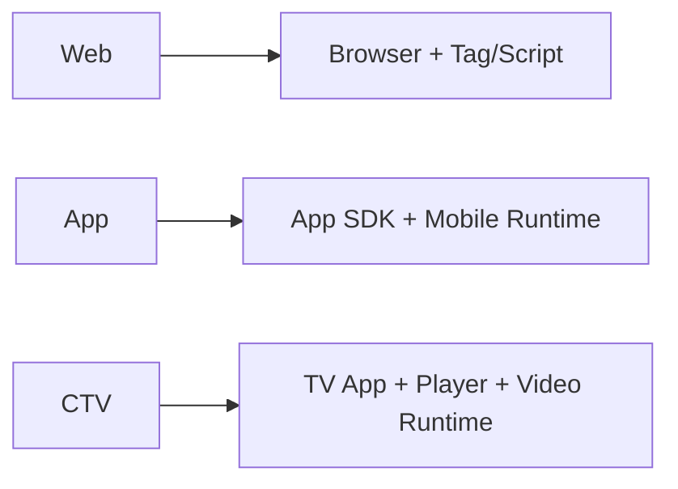

# 웹, 앱, CTV는 어떻게 다른가

## 문서 목적

광고플랫폼을 이해할 때 자주 혼동되는 `웹`, `앱`, `CTV` 환경의 차이를 정리한다. 같은 OpenRTB 문맥을 쓰더라도 런타임 실행 주체, 측정 방식, creative 전달 구조가 어떻게 달라지는지 설명한다.

## 핵심 요약

- 웹은 브라우저와 tag/script 중심 실행 환경이다.
- 앱은 SDK와 app bundle 중심 실행 환경이다.
- CTV는 앱 기반이지만 player, video measurement, household device 특성이 더 강하게 작용한다.
- 같은 광고 요청이라도 식별자, 렌더링 주체, 이벤트 수집 방식이 채널마다 다르다.

## 비교 도식

## 채널별 핵심 차이

|항목|웹|앱|CTV|
|---|---|---|---|
|실행 주체|브라우저, tag, script|앱 SDK, mediation SDK|TV 앱, player SDK|
|컨텍스트 객체|`site`|`app`|`app` 중심|
|식별 기준|domain, page URL|bundle, store URL|bundle, app/store, device 특성|
|대표 포맷|display, video|display, rewarded, interstitial, video|주로 video|
|측정 특성|브라우저 제약, 쿠키/식별 제한|SDK 이벤트 기반|player 이벤트, quartile, completion 중요|

## 1. 웹

- 퍼블리셔 도메인과 페이지 URL이 중요한 컨텍스트다.
- ad tag, header bidding script, player script가 runtime 요청을 발생시키는 경우가 많다.
- 브라우저 정책과 privacy 제약의 영향을 크게 받는다.

## 2. 앱

- 앱 SDK가 광고 요청과 렌더링의 핵심 실행 주체다.
- `bundle`, `storeurl`, `app-ads.txt` 검증 구조가 중요하다.
- rewarded, interstitial, in-app video처럼 앱 특화 포맷이 자주 등장한다.

## 3. CTV

- 기술적으로는 앱 문맥과 가깝지만, 실무적으로는 video/streaming 플랫폼 특성이 더 강하다.
- player가 measurement와 quartile 발생의 중심이 되며, completion과 buffering 문맥이 중요하다.
- household/shared device 특성 때문에 모바일 앱과 같은 사용자 식별 가정이 항상 성립하지 않는다.

## 구현 관점 메모

- 채널에 따라 동일한 이벤트 이름이라도 발생 기준이 달라질 수 있다.
- 문서와 로그 설계에서 `channel`, `runtime`, `player_type`, `sdk_type` 같은 필드를 초기에 분리해 두는 편이 좋다.

## 관련 문서

- [광고 요청과 Bid Request의 차이](/fundamentals/ad-request-vs-bid-request)
- [site, app, imp 객체 읽는 법](/standards/site-app-imp)
- [TrackingEvents, impression, click, quartile 이해](/measurement/tracking-events)
