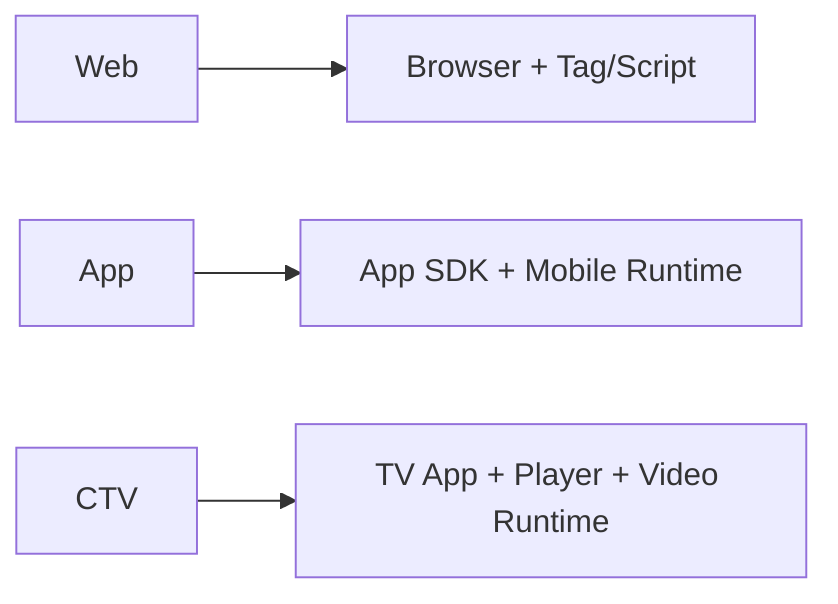

# How Web, App, and CTV Differ

## Purpose

This document explains the practical differences between web, app, and CTV environments in ad platform design. Even when the same standards are involved, runtime behavior, measurement, and creative delivery differ by channel.

## Key Takeaways

- Web is centered on browsers and tag or script execution.
- App is centered on SDK-driven runtime behavior and bundle-based identity.
- CTV is app-based, but player-driven video execution and household device context matter more.
- The same request concept can lead to different identifiers, renderers, and event rules across channels.

## Channel Comparison

|Dimension|Web|App|CTV|
|---|---|---|---|
|Runtime owner|Browser, tag, script|App SDK, mediation SDK|TV app, player SDK|
|Context object|`site`|`app`|Mostly `app`|
|Identity basis|Domain, page URL|Bundle, store URL|Bundle, app/store, device context|
|Common formats|Display, video|Display, rewarded, interstitial, video|Mostly video|
|Measurement emphasis|Browser constraints, privacy limits|SDK event collection|Player events, quartiles, completion|

## 1. Web

- Domain and page URL are key context signals.
- Ad tags, header bidding scripts, and player scripts often initiate runtime requests.
- Browser policies and privacy restrictions affect execution and identity.

## 2. App

- The SDK is usually the main runtime owner for request, render, and tracking behavior.
- `bundle`, `storeurl`, and `app-ads.txt` matter more than page-level context.
- Rewarded, interstitial, and in-app video formats appear more often.

## 3. CTV

- Technically close to app, but operationally much closer to a video and player environment.
- The player becomes the main owner of quartiles, completion, and playback state.
- Household or shared-device assumptions often differ from mobile app assumptions.

## Implementation Notes

- The same event name may not mean exactly the same thing across channels.
- It helps to separate `channel`, `runtime`, `player_type`, and `sdk_type` early in schema design.

## Related Documents

- [Ad Request vs Bid Request](/en/fundamentals/ad-request-vs-bid-request)
- [How to Read site, app, and imp](/en/standards/site-app-imp)
- [Understanding TrackingEvents, impression, click, and quartile](/en/measurement/tracking-events)
