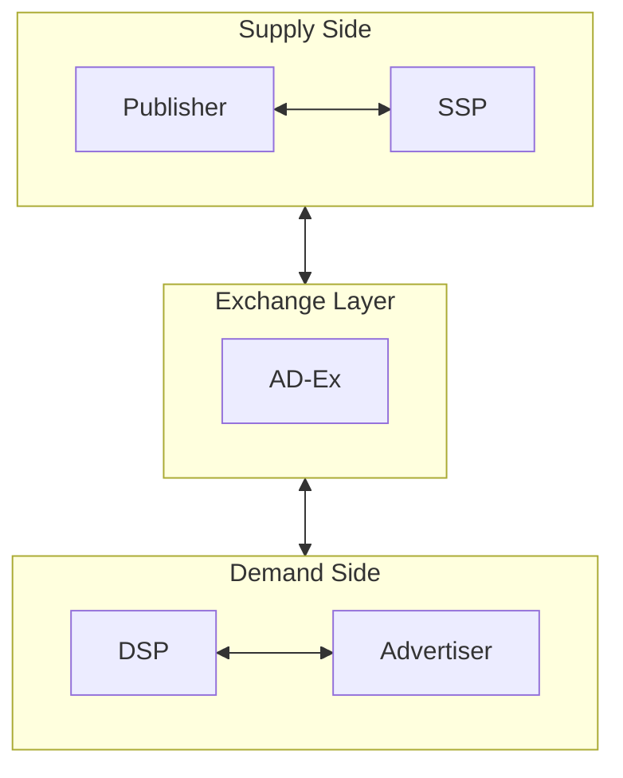

# Roles of Publisher, SSP, DSP, and Exchange

## Purpose

This document clarifies the roles of the core players that are frequently confused in ad platform discussions.

## Key Takeaways

- Publishers provide the inventory where ads are shown.
- SSPs optimize monetization from the publisher side.
- Exchanges operate as a transaction layer between supply and demand.
- DSPs optimize media buying from the advertiser side.
- Advertisers define budget, targeting, and creative goals.

## Relationship Diagram

## Draft Structure

### 1. Publisher

- Provides ad slots and content context.
- Can be a website, mobile app, or CTV app.

### 2. SSP

- Optimizes monetization of publisher inventory.
- Can manage floors, routing, prioritization, auction outcomes, and log collection.

### 3. Exchange

- Acts as the transaction layer where demand and supply meet.
- In practice, exchange and SSP responsibilities may overlap.

### 4. DSP

- Evaluates bidding opportunities based on advertiser goals and targeting conditions.
- Determines whether to bid and how much to bid.

### 5. Advertiser

- Defines budget, campaign goals, and targeting conditions.
- Decides through the DSP which audiences and inventory to buy.

## Common Misunderstandings

- An SSP is not the system that creates ad creatives.
- A DSP is not usually the runtime that renders the ad.
- An exchange is not always a completely separate business entity.

## Prerequisite Document

- [Ad Platform Ecosystem Overview](/en/fundamentals/ecosystem-overview)

## Next Document

- [Ad Request vs Bid Request](/en/fundamentals/ad-request-vs-bid-request)
