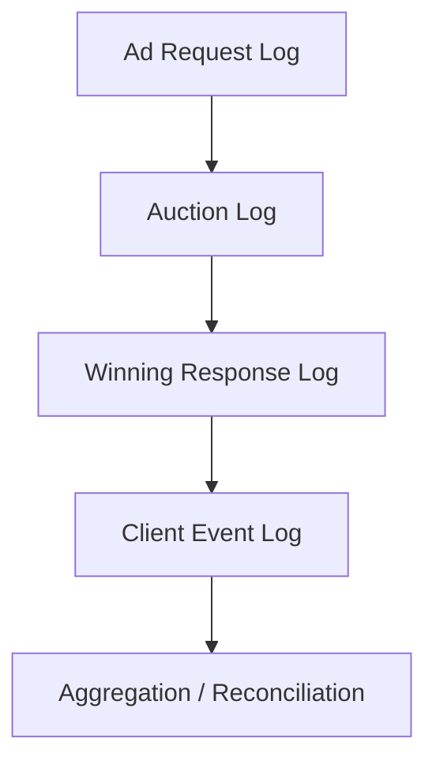

# Event Log Schema Basics

## Purpose

This document introduces a practical baseline for ad platform event logging. It explains how to separate request, auction, delivery, client-event, and reconciliation layers so that later analysis remains possible.

## Key Takeaways

- Ad platform logs are easiest to reason about when separated into `request`, `auction`, `delivery`, `client event`, and `reconciliation` layers.
- A server-side impression and a client-side impression do not necessarily serve the same purpose.
- Without linking keys such as `auction_id`, `imp_id`, `creative_id`, and `placement_id`, reconciliation becomes much harder.

## Suggested Structure

## 1. Request log

- Records the runtime ad request sent from the publisher-side execution layer to the SSP or mediation layer.
- Common fields include `request_id`, `placement_id`, `channel`, device or app or site context, and `request_time`.

## 2. Auction log

- Records bids, bidders, price, currency, seat, and win status.
- Common keys include `auction_id`, `imp_id`, `bidder_id`, `price`, and `creative_id`.

## 3. Delivery log

- Records how the winning creative was delivered.
- This is where `adm`, VAST, asset URLs, macro expansion, and capability signals may appear.

## 4. Client event log

- Records impression, click, quartile, complete, and similar runtime events.
- This layer is central for measurement and discrepancy analysis because it reflects actual runtime behavior.

## 5. Reconciliation layer

- Compares systems and produces operational source-of-truth outputs.
- It is usually safer to keep reconciliation outputs separate from raw event storage after deduplication and idempotency rules are applied.

## Design Checklist

- Are linking keys preserved across server and client logs
- Are timestamps stored in UTC or a clearly defined timezone basis
- Is there an idempotency key to detect duplicates
- Is ownership clear by log layer

## Related Documents

- [Introduction to Discrepancy and Reconciliation](/en/measurement/discrepancy-and-reconciliation)
- [Understanding TrackingEvents, impression, click, and quartile](/en/measurement/tracking-events)
- [How Web, App, and CTV Differ](/en/channels/web-app-ctv)
