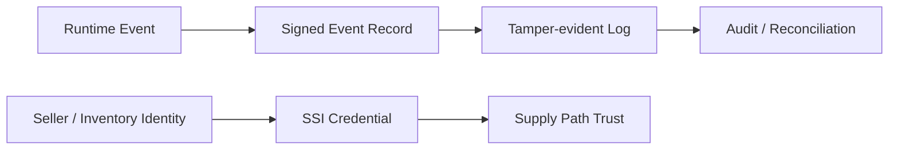

# What SSI and Blockchain Can Be Used to Experiment With in Ad Platforms

## Purpose

This document explains where technologies such as SSI and blockchain may be applied experimentally in ad platforms, assuming the reader already understands the current standards and operational structure.

## Key Takeaways

- SSI and blockchain are not required components of today's ad platform stack.
- They become interesting when stronger guarantees are needed for seller identity, inventory provenance, tamper-evident audit trails, or cryptographic proof.
- They should be discussed only after the reader understands OpenRTB, measurement, reconciliation, and source-of-truth design.

## What Problems Are We Trying to Strengthen

Recurring questions in ad platforms include:

- Can seller identity be proven more strongly
- Can provenance be attached more clearly to events across the chain
- Can log tampering risk be reduced for billing or audit
- Can a shared event chain be described more transparently across multiple parties

## Possible Experiment Points

### 1. SSI-based identity experiments

- This approach treats seller, publisher, or inventory-owner claims as verifiable credentials.
- In practice it is more realistic as a reinforcement layer than as a replacement for ads.txt or sellers.json.

### 2. Blockchain or tamper-evident log experiments

- Writing every advertising event to a public chain is often unrealistic in cost and performance terms.
- A more realistic path is to anchor only critical billing or audit digests to a proof layer.

### 3. Provenance-focused experiments

- This focuses on linking bid requests, creative handoff, player runtime events, and billing events more convincingly.
- It also connects back to the design concerns that OpenRTB 3.0 raised around signed requests and provenance.

## Interpretation Rules

- Do not explain Web3 as if it were the baseline model of current ad platforms.
- Treat it as an experiment that may reinforce limits in current standards and operations.
- Even without a public blockchain, signed logs, cryptographic proof, and verifiable credentials can still be meaningful.

## Prerequisite Documents

- [Why OpenRTB 3.0 Did Not Expand Broadly and Why 2.6 Continued](/en/standards/openrtb-3-and-2-6)
- [Introduction to Discrepancy and Reconciliation](/en/measurement/discrepancy-and-reconciliation)
- [Event Log Schema Basics](/en/implementation/event-log-schema)

## Related Documents

- [Trust · Web3 Lab](/en/lab/)
- [Understanding sellers.json and schain](/en/measurement/sellers-json-and-schain)
