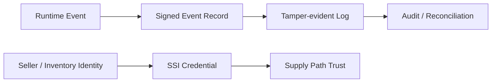
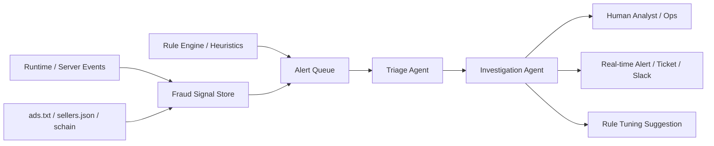

# What SSI, Blockchain, and AI Agents Can Be Used to Experiment With in Ad Platforms

## Purpose

This document explains where technologies such as SSI, blockchain, and AI agents may be applied experimentally in ad platforms, assuming the reader already understands the current standards and operational structure.

## Key Takeaways

- SSI, blockchain, and AI agents are not required components of today's ad platform stack.
- They become interesting when stronger guarantees are needed for seller identity, inventory provenance, tamper-evident audit trails, or cryptographic proof.
- Recent agent technology also opens a practical path for `real-time fraud triage, investigation, and alerting` around IVT, spoofing, and supply-path abuse.
- They should be discussed only after the reader understands OpenRTB, measurement, reconciliation, and source-of-truth design.

## What Problems Are We Trying to Strengthen

Recurring questions in ad platforms include:

- Can seller identity be proven more strongly
- Can provenance be attached more clearly to events across the chain
- Can log tampering risk be reduced for billing or audit
- Can a shared event chain be described more transparently across multiple parties

## Possible Experiment Points

### 1. SSI-based identity experiments

- This approach treats seller, publisher, or inventory-owner claims as verifiable credentials.
- In practice it is more realistic as a reinforcement layer than as a replacement for ads.txt or sellers.json.

### 2. Blockchain or tamper-evident log experiments

- Writing every advertising event to a public chain is often unrealistic in cost and performance terms.
- A more realistic path is to anchor only critical billing or audit digests to a proof layer.

### 3. Provenance-focused experiments

- This focuses on linking bid requests, creative handoff, player runtime events, and billing events more convincingly.
- It also connects back to the design concerns that OpenRTB 3.0 raised around signed requests and provenance.

### 4. AI-agent experiments for real-time ad fraud detection and alerting

Recent agent technology is strong at cross-system analysis and orchestration through a combination of `model + tools + instructions/guardrails`. That pattern can be explored in ad fraud operations as well.

Recurring questions include:

- whether sudden impression or click bursts are legitimate traffic or IVT
- how to interpret domain or app spoofing, schain mismatches, and seller identity anomalies across multiple logs
- how to prioritize a flood of alerts that humans cannot review one by one
- how to keep improving detection rules without overwhelming operations teams with false positives

In this context, an agent is better treated not as the fraud detector itself, but as an `investigation and response orchestration layer` sitting on top of the detection stack.

Possible experiment points include:

- triage agent: prioritizes alert volume and summarizes why a pattern looks suspicious
- investigation agent: cross-checks SSP logs, client events, schain, and seller-authority signals
- notification agent: routes high-risk cases into real-time operational channels
- detection engineering agent: suggests rule improvements based on recurring patterns

This approach still needs strong boundaries:

- begin with read-heavy assistance rather than autonomous blocking
- keep human approval and deterministic rules for actions with billing or traffic impact
- preserve traces and explanation data so false positives and misses can be reviewed later

This framing is an inference from OpenAI's agent design and guardrail guidance and Google's `agentic SOC` pattern in security operations, adapted to the ad fraud domain. It should be treated as an operational extension, not as a replacement for current ad platform standards.

## Interpretation Rules

- Do not explain Web3 or AI agents as if they were the baseline model of current ad platforms.
- Treat them as experiments that may reinforce limits in current standards and operations.
- Even without a public blockchain, signed logs, cryptographic proof, and verifiable credentials can still be meaningful.
- AI agents should be interpreted as an orchestration layer that accelerates investigation and response on top of deterministic rules and existing fraud systems.

## Prerequisite Documents

- [What OpenRTB 3.0 aimed for and what returned in 2.6](/en/standards/openrtb-3-and-2-6)
- [Introduction to Discrepancy and Reconciliation](/en/measurement/discrepancy-and-reconciliation)
- [Event Log Schema Basics](/en/implementation/event-log-schema)

## Related Documents

- [Trust · Web3 Lab](/en/lab/)
- [Understanding sellers.json and schain](/en/measurement/sellers-json-and-schain)

## Official References

- [A practical guide to building AI agents](https://openai.com/business/guides-and-resources/a-practical-guide-to-building-ai-agents/)
- [Agentic SOC](https://cloud.google.com/solutions/security/agentic-soc)
- [New capabilities for building agents on the Anthropic API](https://claude.com/blog/agent-capabilities-api)
