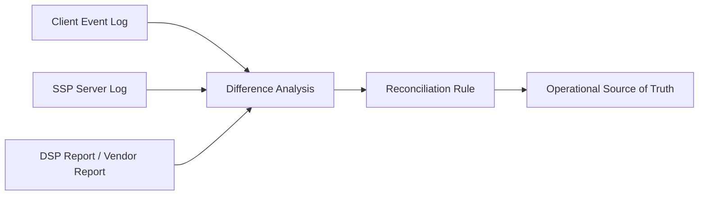

# Introduction to Discrepancy and Reconciliation

## Purpose

This document explains why different ad platform systems often report different counts and how those differences are operationally reconciled.

## Key Takeaways

- `discrepancy` refers to differences between platform-side counts.
- `reconciliation` refers to the process of analyzing those differences and aligning an operational reporting basis.
- SSPs, DSPs, SDKs, and measurement vendors naturally observe events at different layers and timing points.

## Basic Flow

## Draft Structure

### 1. Why discrepancies happen

- timing differences
- render success criteria
- duplicate collection and timeout behavior

### 2. Why reconciliation matters

- to align billing and reporting
- to create a shared operational source of truth

### 3. Practical checkpoints

- the different roles of server logs and client logs
- where measurement vendor data enters the flow
- deduplication and idempotency rules

## Prerequisite Concept

- [Understanding Ad Platforms Through Trust and Web3](/en/trust/)

## Next Document

- [Understanding sellers.json and schain](/en/measurement/sellers-json-and-schain)
