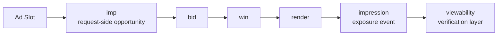

# Why imp and impression are different

## Purpose

This document explains the difference between `imp` and `impression`, which are often confused in ad platform discussions, by separating them by timing, data structure, and ownership.

## Key Takeaways

- `imp` is a request-side object that defines an ad opportunity inside an OpenRTB bid request.
- `impression` is the event recorded when the ad is actually counted as exposed.
- They share a word root, but they are not the same thing.
- In system design, `request`, `win`, `exposure`, and `verification` should remain separate stages.

## One-Page View

## 1. What `imp` is

- `imp` is an object inside an OpenRTB bid request.
- It is how the SSP or exchange tells a bidder that a specific ad opportunity exists.
- It does not mean the ad has been shown. It defines the opportunity before the auction result is rendered.

## 2. What `impression` is

- `impression` is the event or counting unit recorded when an ad is counted as exposed.
- It is usually produced by a client-side runtime such as an SDK, player, tag, or tracking layer.
- The exact counting rule can differ by display versus video context, SDK behavior, or measurement vendor logic.

## 3. The timing difference makes the distinction clear

|Stage|Key Concept|Explanation|
|---|---|---|
|Request|`imp`|The ad opportunity is defined.|
|Bid|`bid`|A DSP responds to that opportunity.|
|Win|`win`|The SSP selects the final ad.|
|Ready to show|`render`|The SDK, player, or WebView executes the creative.|
|Counted exposure|`impression`|The ad is recorded as an impression event.|
|Visibility check|`viewability`|A separate layer verifies whether it was actually seen.|

## 4. What must be separated in real implementations

|Stage|Main Event|Primary Owner|
|---|---|---|
|Request|`imp` creation|SSP or ad server|
|Win|`win notice`|SSP, DSP|
|Rendering|creative render|SDK, player, WebView|
|Exposure|`impression`|SDK, client tracker, player|
|Verification|viewability, verification|OMID, measurement vendor, SDK integration|

## 5. Why teams often confuse them

- The name `imp` sounds similar to `impression`.
- If a server counts win-time outcomes as impressions, actual render failures are missed.
- If impression and viewability are treated as the same thing, verification design becomes ambiguous.

## 6. Common operational risks

### Server-side impression counting

- The system may count ads that never actually appeared on screen.
- This can damage advertiser trust and widen discrepancies.

### Missing render failures

- A bid may win while the creative never actually runs.
- In that case, revenue, billing, and performance reporting diverge.

### Failing to separate viewability

- An impression can be recorded even if the ad was not meaningfully seen.
- That is why OMID, verification, and viewability need to remain a distinct layer.

## Implementation Notes

- Server logs should keep `request_id`, `imp_id`, `auction_id`, and win-time signals.
- Client logs should separately record `render`, `impression`, `click`, `quartile`, and `viewability`.
- For reconciliation, `imp_id` and `auction_id` are the primary join keys between server and client timelines.
- The structural design principle is to separate `request / win / exposure / verification`.

## Prerequisite Concept

- [How to Read site, app, and imp](/en/standards/site-app-imp)

## Next Documents

- [Understanding TrackingEvents, impression, click, and quartile](/en/measurement/tracking-events)
- [Introduction to Discrepancy and Reconciliation](/en/measurement/discrepancy-and-reconciliation)

## Related Documents

- [OpenRTB 2.6 Required and Recommended Fields at a Glance](/en/standards/openrtb-required-and-recommended)
- [What Goes in the adm Field](/en/delivery/adm-field)
- [Event Log Schema Basics](/en/implementation/event-log-schema)
