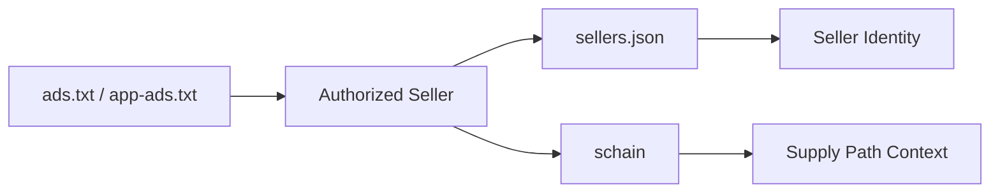

# Understanding sellers.json and schain

## Purpose

This document introduces `sellers.json` and `schain` as mechanisms for supply path interpretation and transparency.

## Key Takeaways

- `sellers.json` discloses seller identity metadata.
- `schain` describes the supply path context attached to a bid request.
- If ads.txt and app-ads.txt are the starting point for seller authorization, sellers.json and schain extend the ability to interpret identity and path.

## Concept Flow

## Draft Structure

### 1. sellers.json

- discloses seller identity and type
- helps interpret seller IDs more clearly

### 2. schain

- carries supply path information in auction requests
- helps describe hops in the supply chain

### 3. Relationship to ads.txt

- ads.txt alone may not be enough to explain seller identity and supply path context
- sellers.json and schain help extend that interpretation

## Related Documents

- [Understanding Ad Platforms Through Trust and Web3](/en/trust/)
- [Understanding ads.txt and app-ads.txt](/en/standards/ads-txt-and-app-ads-txt)
