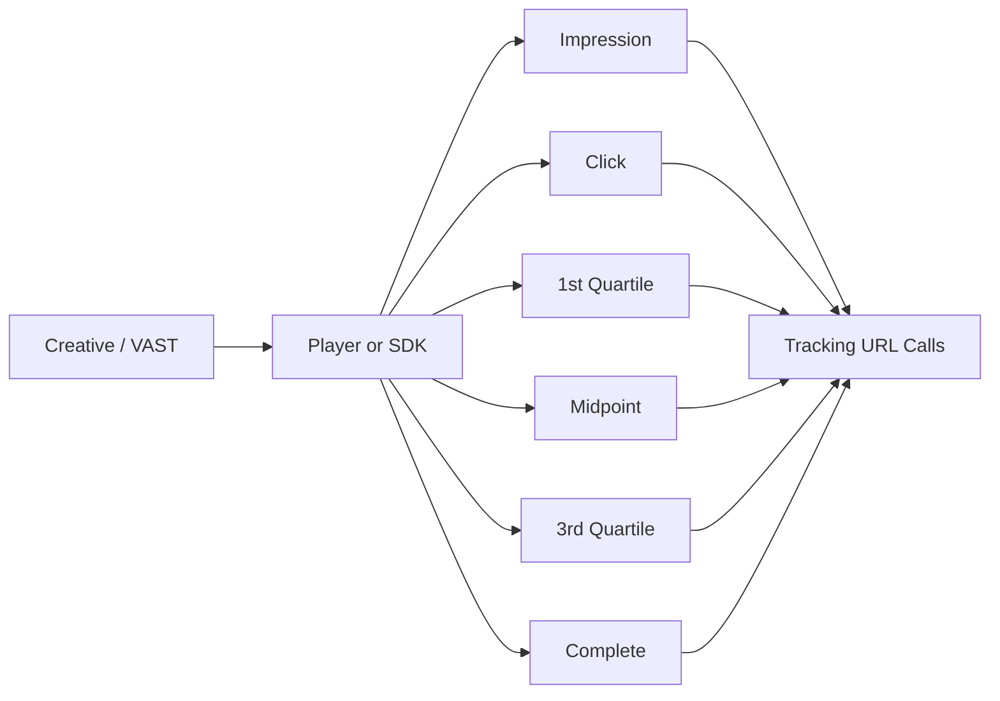

# Understanding TrackingEvents, impression, click, and quartile

## Purpose

This document explains the event terms and counting units that repeatedly appear in ad platform measurement, especially in VAST and video contexts.

## Key Takeaways

- `impression` represents the point at which an ad is counted as shown or eligible to be shown.
- `click` represents user interaction with the ad.
- `quartile` events divide video playback progress into 25%, 50%, 75%, and 100% milestones.
- `TrackingEvents` refers to the tracking URL set tied to those runtime events.

## Event Flow

## 1. What impression means

- In display, it is often tied to creative render or a renderable state.
- In video, it is often tied to the point where playback can begin.
- The precise counting rule can vary by platform, SDK, or measurement vendor.

## 2. What click means

- It records that a user interacted with the creative.
- It can exist in both display and video flows, but collection points differ by runtime and vendor.
- Because click counts are much smaller than impression counts, filtering and duplication can have an outsized impact.

## 3. When quartiles matter

- Quartiles are mainly used in video measurement.
- A common sequence is `start`, `firstQuartile`, `midpoint`, `thirdQuartile`, and `complete`.
- Completion rate and drop-off analysis are usually derived from these events.

## 4. What TrackingEvents are

- In VAST, each event can map to one or more tracking URLs.
- The player or SDK calls those URLs when the event occurs.
- Accurate tracking therefore depends on creative markup, player logic, network calls, and server-side ingestion working together.

## 5. Why counts differ

- A player may emit an event while the network call fails.
- SSPs, DSPs, and measurement vendors may count the event at different points.
- Autoplay, mute, buffering, skip, and background transitions can all change runtime behavior.

## Implementation Notes

- Event schemas should keep `event_name`, `event_time`, `creative_id`, `auction_id`, `placement_id`, and device or session identifiers together.
- Impression and quartile events often need idempotency handling because duplicates and retries are common in video runtimes.

## Related Documents

- [What Goes in the adm Field](/en/delivery/adm-field)
- [Introduction to Discrepancy and Reconciliation](/en/measurement/discrepancy-and-reconciliation)
- [Event Log Schema Basics](/en/implementation/event-log-schema)
