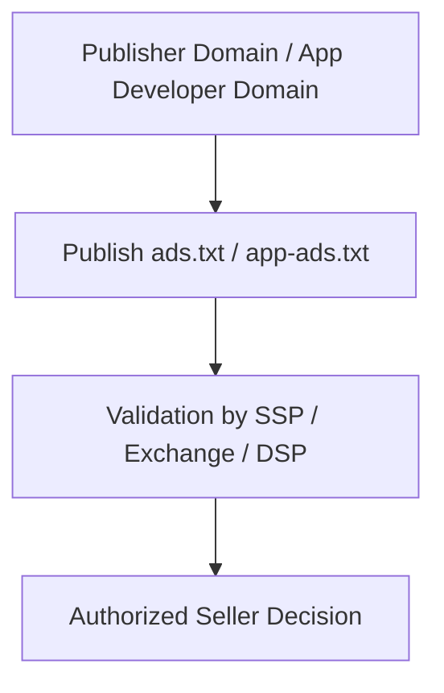

# Understanding ads.txt and app-ads.txt

## Purpose

This document explains the role of `ads.txt` and `app-ads.txt` as foundational mechanisms for publisher authorization and supply path transparency.

## Key Takeaways

- `ads.txt` is a file published by web publishers to disclose authorized sellers.
- `app-ads.txt` extends the same idea to apps and CTV app environments.
- These standards improve selling transparency and help reduce seller spoofing, but they do not replace onboarding, placement registration, or broader trust controls.

## Concept Flow

## Draft Structure

### 1. What is ads.txt

- A public file hosted on a publisher domain.
- It declares which sellers are authorized to sell that publisher's inventory.

### 2. What is app-ads.txt

- The app counterpart to ads.txt.
- It links store metadata and developer domains to seller authorization.

### 3. Why it matters

- It helps reduce inventory spoofing and seller impersonation.
- It forms a baseline layer for supply path transparency.

### 4. Limitations

- It does not solve every fraud, quality, or trust issue on its own.
- Additional signals such as sellers.json, schain, and log validation are still important.

## Related Documents

- [Publisher Onboarding and Placement Registration](/en/fundamentals/publisher-onboarding)
- `sellers.json and schain` draft planned
