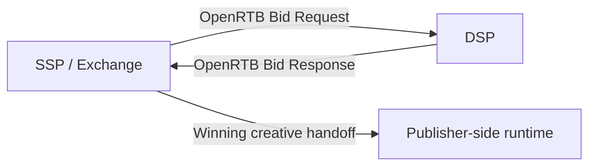

# DSP ↔ SSP / Exchange: RTB auction segment

## Purpose

This document explains the `DSP ↔ SSP / Exchange` auction flow, the segment where standardization is strongest in the ad platform stack. It serves as the baseline for understanding where OpenRTB is directly applied.

## Key Takeaways

- This is the primary segment where OpenRTB operates most directly.
- SSPs or exchanges construct the bid request, and DSPs return the bid response.
- `imp`, `site/app`, `device`, `user`, `source`, `regs`, and `pmp` are central on the request side.
- `price`, `adm`, `nurl`, `burl`, `dealid`, and `crid` matter on the response side.

## Main concerns in this segment

|Concern|Description|
|---|---|
|Bid evaluation|whether the DSP will bid and at what price|
|Auction control|auction type, timeout, blocked categories, seat constraints|
|Creative delivery|which markup or VAST payload is returned on a winning bid|
|Deal handling|how PMP and deal conditions are applied|
|Privacy and regulation|how `regs`, consent, ID signals, and supply transparency are interpreted|

## Standard protocol status

|Item|Assessment|
|---|---|
|Primary standard protocol|OpenRTB|
|Main scope|auction requests and responses between SSP / Exchange and DSP|
|Practical extension areas|supply chain, identity, privacy, and CTV-related signals continue to evolve|

## Core fields often seen in bid requests

- `id`
- `imp`
- `site` or `app`
- `device`
- `user`
- `source`
- `regs`
- `pmp`
- `at`, `tmax`, `cur`, `bcat`, `badv`, `wseat`, `bseat`

## Core fields often seen in bid responses

- `price`
- `adm`
- `nurl`
- `burl`
- `lurl`
- `adomain`
- `crid`
- `dealid`

## Data flow in this segment

## Practical interpretation

This segment decides `who bids with what price and what creative`. Even though the SDK or player eventually renders the ad, the core auction data that determines the outcome moves through this segment.

## Related Documents

- [What Is OpenRTB](/en/standards/openrtb-overview)
- [OpenRTB 2.6 Required and Recommended Fields at a Glance](/en/standards/openrtb-required-and-recommended)
- [How to read OpenRTB top-level control fields](/en/standards/top-level-control-fields)
- [SSP ↔ Publisher SDK / Player / Tag: ad delivery segment](/en/standards/ssp-to-publisher-sdk)
