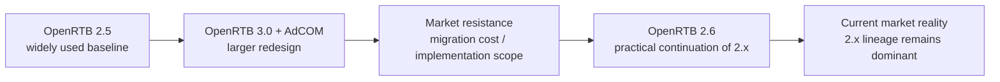

# What OpenRTB 3.0 aimed for and what returned in 2.6

## Purpose

This document explains how the standard evolved after OpenRTB 2.5, what OpenRTB 3.0 tried to achieve, and how part of that direction returned in more practical form through OpenRTB 2.6.

## Key Takeaways

- OpenRTB 3.0 was not just a minor upgrade. It proposed a broader redesign together with AdCOM and Ad Management.
- That direction was architecturally meaningful, but the market preferred incremental evolution over a full migration.
- IAB Tech Lab later described how ideas from OpenRTB 3.0 and AdCOM were being absorbed back into the 2.x ecosystem and introduced OpenRTB 2.6 with an emphasis on faster speed to market.
- The most practical learning order is `2.5 as the baseline -> 3.0 as the design ambition -> market resistance -> 2.6 as the practical bridge`.

## Version Flow at a Glance

## 1. What OpenRTB 3.0 Tried to Solve

OpenRTB 3.0 tried to move beyond incremental message extensions and instead build a cleaner structure around a shared advertising object model and management layers.

Its direction included:

- a stronger dependency on AdCOM for common object modeling
- broader interoperability goals beyond a simple auction message format
- a greater focus on signed requests, provenance, and stronger security assumptions

## 2. Why the market did not move directly to 3.0

IAB Tech Lab later explained that features from OpenRTB 3.0 and AdCOM were being added back into older 2.x flows. From that, the following interpretation is reasonable:

- 3.0 required more than a simple version bump because multiple companion specifications had to be understood together
- the market already had broad 2.x deployment, so there was limited appetite for a full migration
- both supply-side and demand-side implementers preferred incremental changes inside existing integrations

This interpretation is based on IAB Tech Lab's own explanation of 3.0 / AdCOM features being pulled into 2.x and its emphasis on faster speed to market when introducing 2.6.

## 3. What returned in practical form through 2.6

OpenRTB 2.6 is better understood as a practical continuation of the 2.x line while bringing in ideas the market urgently needed. Not everything in 3.0 returned, but some of its motivation clearly reappeared in a more deployable form.

From an implementation perspective, it matters because:

- it keeps high continuity with existing 2.5 integrations
- it matches the operational reality of SSP, DSP, and exchange integrations more closely
- it allows more incremental migration paths
- it creates a more practical path for modern concerns such as CTV, pod bidding, AdCOM alignment, and ID provenance work

In that sense, 2.6 is not a rejection of the 3.0 vision. It is a more deployable expression of some of that vision.

## 4. Interpretation Rule for This Handbook

- OpenRTB 2.5 is the operational baseline.
- OpenRTB 3.0 shows the architectural direction.
- OpenRTB 2.6 is the more practical bridge for today's market.
- Core fields such as `site`, `app`, `device`, `user`, `regs`, `pmp`, and `deal` are better taught as practical concern areas than as version-specific trivia.
- Topics such as SSI, provenance, and cryptographic proof belong after that, in the handbook's lab section.

## Related Documents

- [What Is OpenRTB](/en/standards/openrtb-overview)
- [How to Read site, app, and imp](/en/standards/site-app-imp)
- [Trust · Web3 Lab](/en/lab/)

## Official References

- [Welcome Back, OpenRTB 2.x](https://iabtechlab.com/welcome-back-openrtb-2-x/)
- [Tech Lab Releases OpenRTB 2.6 for Public Comment](https://dev.iabtechlab.com/press-releases/tech-lab-releases-openrtb-2-6-for-public-comment/)
- [IAB Tech Lab OpenRTB Standard](https://dev.iabtechlab.com/standards/openrtb/)
