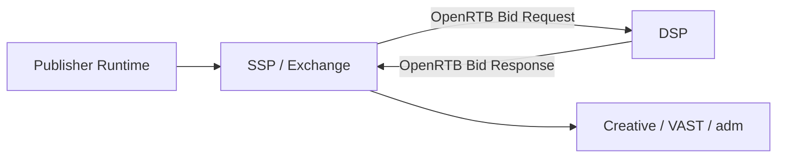

# What Is OpenRTB

## Purpose

This document introduces `OpenRTB` as the most widely used standard request and response framework for real-time bidding.

## Key Takeaways

- OpenRTB standardizes auction communication between SSPs or exchanges and DSPs.
- It does not define every part of the ad platform lifecycle.
- Reading OpenRTB well means understanding objects such as `imp`, `site`, `app`, `device`, `user`, and `regs`.

## Why It Matters

- It creates a common language for bidding.
- It reduces integration friction between demand and supply systems.
- It helps teams understand which data shapes auction decisions.

## One-Page View

## Draft Structure

### 1. What OpenRTB covers

- bid requests
- bid responses
- auction context

### 2. Adjacent topics to read next

- ads.txt and app-ads.txt
- creative rendering and `adm`
- verification and measurement

### 3. First objects to learn

- `imp`
- `site` or `app`
- `device`
- `user`
- `regs`

## Related Documents

- [How to Read site, app, and imp](/en/standards/site-app-imp)
- [Understanding ads.txt and app-ads.txt](/en/standards/ads-txt-and-app-ads-txt)
- [What Goes in the adm Field](/en/delivery/adm-field)
