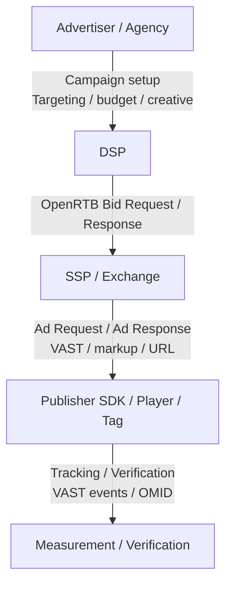

# Protocol boundaries and data handoff by segment

## Purpose

This document explains the ad platform flow by `segment`, not just by `role`. The goal is to distinguish where strong industry standards exist, where platform-specific common models dominate, and which kinds of data are exchanged in each segment.

## Key Takeaways

- Ad platforms do not run on a single protocol from start to finish.
- The `DSP ↔ SSP / Exchange` segment is the strongest standards-driven segment, centered on OpenRTB.
- The `SSP ↔ Publisher SDK / Player / Tag` segment follows common industry patterns, but not one dominant universal protocol.
- The `SDK / Player ↔ Measurement / Verification` segment relies heavily on VAST tracking and OM SDK / OMID.
- The `Advertiser · Agency ↔ DSP` segment is closer to campaign control than to runtime auctioning.

## Big Picture

## At a Glance

|Segment|Primary concern|Strong protocol|Representative data|
|---|---|---|---|
|Advertiser · Agency ↔ DSP|campaign setup, targeting, budget, creative operations|No dominant universal standard|campaign, line item, creative, audience, budget, goal|
|DSP ↔ SSP / Exchange|auctioning, bidding, pricing, creative handoff|OpenRTB|`id`, `imp`, `site/app`, `device`, `user`, `source`, `regs`, `price`, `adm`|
|SSP ↔ Publisher SDK / Player / Tag|ad request, ad response, creative / VAST delivery|No dominant universal standard, VAST is important in video|placement, app/site context, VAST URL/XML, markup, trackers|
|SDK / Player ↔ Measurement / Verification|impression, click, progress, viewability, verification|VAST Tracking, OM SDK / OMID|impression, click, quartile, `AdVerifications`, OM session|

## Why this distinction matters

### 1. To avoid overstating OpenRTB

OpenRTB is extremely important, but it is strongest in the `SSP ↔ DSP / Exchange` auction segment. The segment where the publisher runtime requests an ad and later emits measurement signals depends on other protocols and runtime rules as well.

### 2. To separate data ownership

- `campaign budget` belongs to the advertiser ↔ DSP control segment.
- `imp`, `device`, and `regs` belong primarily to the bid request segment.
- `adm`, VAST URLs, and markup bridge the auction outcome into delivery.
- `impression`, `click`, `quartile`, and `viewability` belong to the runtime event segment.

### 3. To make system design discussions more precise

Many recurring confusions come from mixing `ad request` with `bid request`, `ad response` with `bid response`, or `imp` with `impression`. Looking at the flow by segment makes the producer and owner of each data type much clearer.

## Related standards

- [OpenRTB](https://dev.iabtechlab.com/standards/openrtb/)
- [VAST](https://dev.iabtechlab.com/specifications-guidelines/vast/)
- [Open Measurement SDK](https://iabtechlab.com/open-measurement-sdk/)
- [CATS](https://iabtechlab.com/standards/cats/)

## Next Documents

- [Advertiser · Agency ↔ DSP: campaign control segment](/en/standards/advertiser-agency-to-dsp)
- [DSP ↔ SSP / Exchange: RTB auction segment](/en/standards/dsp-to-ssp-exchange)
- [SSP ↔ Publisher SDK / Player / Tag: ad delivery segment](/en/standards/ssp-to-publisher-sdk)
- [SDK / Player ↔ Measurement / Verification: runtime event segment](/en/standards/sdk-to-measurement-verification)
