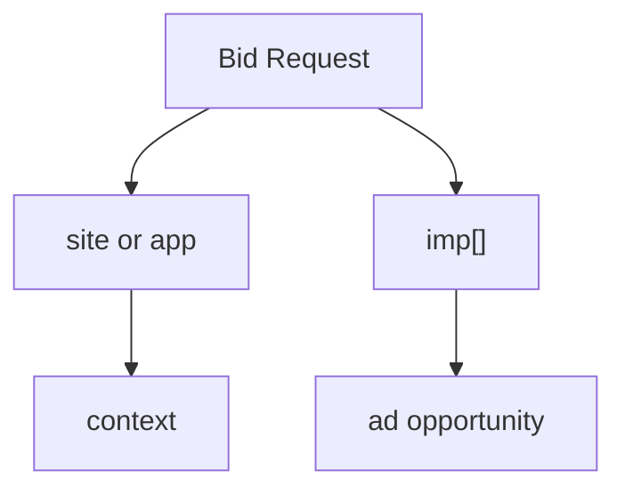

# How to Read site, app, and imp

## Purpose

This document explains how to interpret the `site`, `app`, and `imp` objects when first reading OpenRTB requests.

## Key Takeaways

- `imp` represents the actual ad opportunity.
- `site` represents web context, while `app` represents app or CTV app context.
- In general, a request uses either `site` or `app`, not both together.

## Data Structure View

## Draft Structure

### 1. `imp`

- represents the ad slot or opportunity
- connects to banner, video, native, or other format definitions
- this `imp` is a request-side object and is different from the runtime `impression` event

### 2. `site`

- represents website or mobile web context
- connects to domain, page, and publisher information

### 3. `app`

- represents app or CTV app context
- connects to bundle, store URL, and app publisher information

## Prerequisite Concept

- [What Is OpenRTB](/en/standards/openrtb-overview)

## Related Documents

- [Understanding ads.txt and app-ads.txt](/en/standards/ads-txt-and-app-ads-txt)
- [OpenRTB 2.6 Required and Recommended Fields at a Glance](/en/standards/openrtb-required-and-recommended)
- [Why imp and impression are different](/en/measurement/imp-vs-impression)
