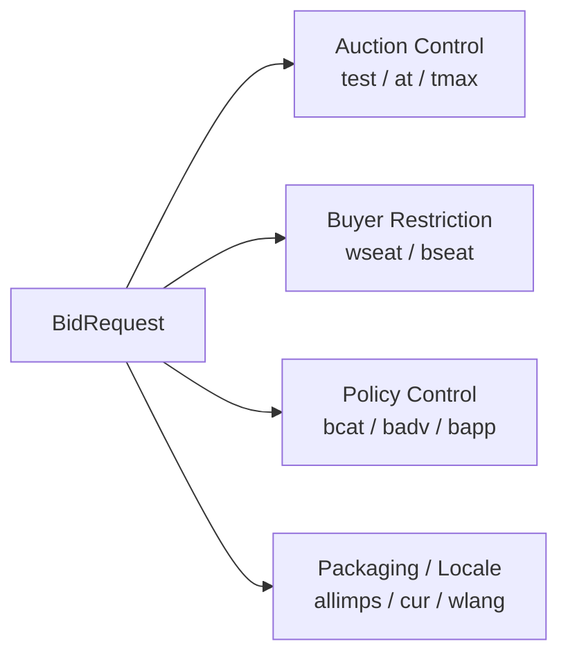

# How to read OpenRTB top-level control fields

## Purpose

This document explains the top-level control fields in an OpenRTB `BidRequest` that shape auction behavior, response timing, buyer restrictions, and blocking policy. Unlike `site`, `app`, `device`, or `user`, these fields are not primarily about context. They are about how the transaction itself should be controlled.

## Key Takeaways

- `test`, `at`, and `tmax` define the runtime behavior and time limits of the auction.
- `wseat`, `bseat`, `bcat`, `badv`, and `bapp` define who may bid and what kinds of ads should be restricted.
- `cur`, `wlang`, and `allimps` help describe currency, language, and packaging scope.
- These fields are easy to overlook, but they matter a great deal in real exchange operations.

## One-Page View

## 1. Why these fields matter

- `imp`, `site`, and `app` describe what is being sold.
- Top-level control fields describe under what rules that opportunity is being transacted.
- If they are absent or ambiguous, bidders often react conservatively or skip the opportunity altogether.

## 2. Auction control fields

|Field|Spec Status|Practical Importance|Practical Interpretation|
|---|---|---|---|
|`test`|Optional, default `0`|Medium|Distinguishes test traffic from billable production traffic.|
|`at`|Optional, default `2`|Very high|Defines the auction type. It directly affects pricing strategy and billing interpretation.|
|`tmax`|Optional|Very high|Sets the maximum response time allowed for bidders. It directly influences timeout behavior and fill rate.|

### Implementation Notes

- `test` is not just a debug flag. It is also important for separating operational reporting from test traffic.
- `at` is essential for interpreting whether the market is behaving like first-price or second-price-plus logic.
- `tmax` that is too short hurts response rates. `tmax` that is too long can hurt user experience and render timing.

## 3. Buyer seat restriction fields

|Field|Spec Status|Practical Importance|Practical Interpretation|
|---|---|---|---|
|`wseat`|Optional|High|Allows only specific buyer seats to bid.|
|`bseat`|Optional|High|Blocks specific buyer seats from bidding.|

### Implementation Notes

- `wseat` and `bseat` are generally not used together.
- These fields only make sense when buyer seat identity is coordinated in advance.
- They often connect to PMP, agency seat, and reseller seat control.

## 4. Blocking policy fields

|Field|Spec Status|Practical Importance|Practical Interpretation|
|---|---|---|---|
|`bcat`|Optional|High|Blocks advertiser categories.|
|`badv`|Optional|High|Blocks advertiser domains.|
|`bapp`|Optional|Medium to high|Blocks application identifiers and is especially relevant in app and CTV contexts.|

### Implementation Notes

- `bcat` should be read together with the category taxonomy in use. In 2.6, `cattax` becomes part of the interpretation.
- `badv` connects domain-based advertiser policy to brand safety and inventory controls.
- `bapp` depends on correct app store ID and bundle or package conventions.

## 5. Supporting control fields

|Field|Spec Status|Practical Importance|Practical Interpretation|
|---|---|---|---|
|`allimps`|Optional, default `0`|Medium|Indicates whether the `imp[]` array represents all relevant opportunities in the current context. Important for road-blocking interpretation.|
|`cur`|Optional|Medium to high|Declares allowed bid currencies. Important when an exchange accepts multiple currencies.|
|`wlang`|Optional|Medium|Restricts the allowed creative language set. Important when language policy matters.|

### Implementation Notes

- `allimps` does not appear in every implementation, but it can matter in multi-slot and pod-style contexts.
- `cur` becomes much more important when the exchange accepts multiple currencies.
- In OpenRTB 2.6, `wlangb` also exists as a more modern language encoding path alongside `wlang`.

## 6. How to think about these fields

- These fields are less about object modeling and more about transaction policy.
- Their presence may look secondary, but misinterpreting them can have outsized operational consequences.
- In practice, `at`, `tmax`, `bcat`, and `badv` often have immediate effects on bidder behavior and policy compliance.

## Implementation Notes

- It is useful to group these fields in logs and configuration under `auction policy`, `buyer policy`, and `content policy`.
- `test`, `at`, and `tmax` should be visible in request-level logs.
- `bcat`, `badv`, and `bapp` should be traceable back to their originating supply-side policy configuration.

## Prerequisite Concept

- [What Is OpenRTB](/en/standards/openrtb-overview)

## Next Documents

- [How to Read site, app, and imp](/en/standards/site-app-imp)
- [OpenRTB 2.6 Required and Recommended Fields at a Glance](/en/standards/openrtb-required-and-recommended)

## Related Documents

- [What OpenRTB 3.0 aimed for and what returned in 2.6](/en/standards/openrtb-3-and-2-6)

## Official References

- [OpenRTB 2.6 PDF](https://iabtechlab.com/wp-content/uploads/2022/04/OpenRTB-2-6_FINAL.pdf)
- [OpenRTB 2.5 FINAL PDF](https://dev.iabtechlab.com/wp-content/uploads/2016/07/OpenRTB-API-Specification-Version-2-5-FINAL.pdf)
- [IAB Tech Lab OpenRTB Standard](https://dev.iabtechlab.com/standards/openrtb/)
