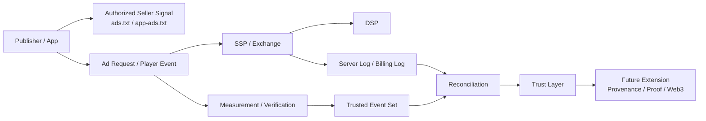

# Understanding Ad Platforms Through Trust and Web3

## Document Purpose

This document introduces a way to read ad platforms not only as auction systems but also as `trust layers`. In this context, trust includes measurability, verifiability, supply path transparency, billing reconciliation, and the possible future use of cryptographic proof infrastructure.

## Key Takeaways

- Modern ad platforms must handle not only delivery but also `who was authorized to sell`, `what actually rendered`, and `which events can be trusted`.
- To address these questions, the industry relies on standards and mechanisms such as `ads.txt`, `app-ads.txt`, `sellers.json`, `schain`, `OMID`, verification tags, and reconciliation workflows.
- `Web3` is not a required component of current ad platform operations, but it offers a useful lens for discussing provenance, tamper-evident logs, and cryptographic proof.
- This category should therefore be read as an extension of current ad tech standards, not as a separate ecosystem replacing them.

## Why This Category Matters

Ad platforms are multi-party systems involving publishers, SSPs, DSPs, measurement vendors, verification vendors, and billing systems. In that environment, delivering an ad is not enough.

Teams repeatedly need to answer questions such as:

- Is this seller actually authorized to sell the inventory
- Did the ad render in the intended placement
- How much confidence can we place in impression, click, quartile, and completion events
- How should discrepancies between platforms be reconciled
- What stronger trust infrastructure might be useful in the future

## Connection to Earlier Standards

This category is best read after the following documents.

- [Ad Request vs Bid Request](/en/fundamentals/ad-request-vs-bid-request)
- [Understanding ads.txt and app-ads.txt](/en/standards/ads-txt-and-app-ads-txt)

The overall flow can be summarized as follows.

## What This Category Covers

### 1. Current standards and operating mechanisms for trust

- ads.txt and app-ads.txt
- sellers.json and schain
- OMID and ad verification
- cross-checking server logs against client logs
- discrepancy and reconciliation

### 2. The trust layer of ad platforms

- how supply paths are explained
- which system acts as the source of truth for each event
- how billing and reporting are aligned

### 3. Questions raised from a Web3 perspective

- whether event provenance can be proven more strongly
- what immutability can contribute to billing and auditability
- whether cryptographic proof layers are useful even without a public ledger

## Reading Principle

- `Web3` should be treated as an extension perspective, not as the baseline requirement of ad platform operations.
- The practical priority remains a precise understanding of current standards and measurement systems.
- The most natural reading order is `standards -> verification -> reconciliation -> trust infrastructure extension`.

## Candidate Follow-up Documents

- Understanding sellers.json and schain
- Separating the roles of OMID and verification
- Basic discrepancy and reconciliation flows
- Trust layers from the perspective of event provenance
- What is valid and what is overstated when discussing Web3 in ad platforms
