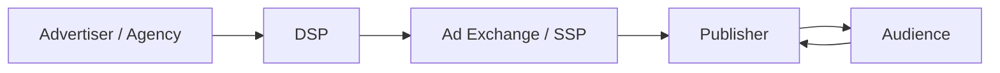

# 광고플랫폼 생태계 한눈에 보기

## 문서 목적

광고플랫폼 생태계의 주요 참여자와 기본 흐름을 한 화면에서 이해할 수 있도록 정리한다.

## 핵심 요약

- 광고플랫폼은 수요 측과 공급 측을 연결하는 거래 구조다.
- 퍼블리셔는 광고 지면을 제공하고, 광고주는 광고 예산을 집행한다.
- DSP, SSP, Exchange는 이 거래를 자동화하고 최적화하는 역할을 맡는다.

## 한 장 요약

## 본문 구조 초안

### 1. 왜 광고플랫폼이 필요한가

- 퍼블리셔는 지면을 판매해야 한다.
- 광고주는 적절한 오디언스에게 광고를 노출해야 한다.
- 플랫폼은 이 거래를 자동화해 규모와 효율을 높인다.

### 2. 주요 참여자

|주체|핵심 역할|
|---|---|
|Advertiser / Agency|광고 예산 집행과 캠페인 운영|
|DSP|광고 구매와 입찰 자동화|
|SSP|광고 지면 판매 최적화|
|Ad Exchange|수요와 공급을 연결하는 거래 레이어|
|Publisher|광고가 노출되는 지면 제공|

### 3. 가장 기본적인 흐름

1. 퍼블리셔 지면에 사용자가 방문한다.
2. 광고 요청이 발생한다.
3. 공급 측 플랫폼이 수요 측에 입찰 기회를 전달한다.
4. 낙찰된 광고가 렌더링된다.
5. 노출과 클릭 등 이벤트가 수집된다.

## 이 문서에서 다루지 않는 범위

- OpenRTB 객체 구조
- ads.txt, app-ads.txt
- tracking, verification, reconciliation 세부 구조

## 후속 연결 문서

- [퍼블리셔, SSP, DSP, Exchange의 역할](/fundamentals/roles)
- [광고 요청과 Bid Request의 차이](/fundamentals/ad-request-vs-bid-request)
