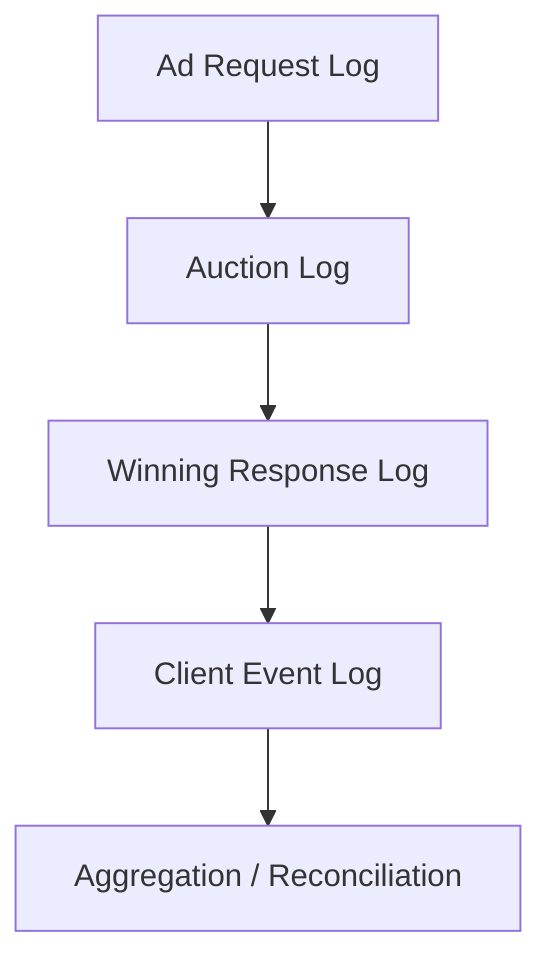

# 이벤트 로그 스키마 설계 기초

## 문서 목적

광고플랫폼을 운영하거나 분석할 때 필요한 이벤트 로그 스키마의 기본 구조를 설명한다. 광고 요청, 경매, creative 전달, runtime 이벤트를 어떤 단위로 분리해 저장해야 하는지 정리한다.

## 핵심 요약

- 광고플랫폼 로그는 `request`, `auction`, `delivery`, `client event`, `reconciliation` 층으로 나눠 보는 것이 가장 명확하다.
- 같은 impression이라도 서버 로그와 클라이언트 로그는 역할이 다르다.
- `auction_id`, `imp_id`, `creative_id`, `placement_id` 같은 연결 키가 없으면 이후 정합성 분석이 어려워진다.

## 권장 구조

## 1. request 로그

- 퍼블리셔 실행 주체가 SSP 또는 mediation layer에 보낸 광고 요청을 기록한다.
- 주요 필드 예시는 `request_id`, `placement_id`, `channel`, `device/app/site context`, `request_time`이다.

## 2. auction 로그

- 경매 요청과 응답, 낙찰 여부, 가격, bidder 수 등을 기록한다.
- `auction_id`, `imp_id`, `bidder_id`, `price`, `currency`, `seat`, `creative_id` 같은 필드가 핵심이다.

## 3. delivery 로그

- 낙찰 creative가 어떤 형태로 전달되었는지 기록한다.
- `adm`, VAST, asset URL, macro 치환 여부, capability 정보가 여기에 들어갈 수 있다.

## 4. client event 로그

- impression, click, quartile, complete 같은 runtime 이벤트를 기록한다.
- 플레이어 또는 SDK에서 발생한 실제 실행 결과를 담기 때문에 measurement와 discrepancy 분석의 핵심이 된다.

## 5. reconciliation 로그 또는 집계 레이어

- 시스템 간 차이를 비교하고 운영 기준값을 결정하기 위한 레이어다.
- raw event를 바로 source of truth로 쓰기보다, deduplication과 idempotency 규칙을 반영한 집계 결과를 별도로 두는 편이 안전하다.

## 설계 체크리스트

- 연결 키가 서버와 클라이언트 로그 모두에 남는가
- 이벤트 시각이 UTC 또는 명확한 타임존 기준으로 기록되는가
- 중복 수집을 식별할 수 있는 idempotency key가 있는가
- 로그 레이어별 ownership이 구분되는가

## 관련 문서

- [Discrepancy와 Reconciliation 개요](/measurement/discrepancy-and-reconciliation)
- [TrackingEvents, impression, click, quartile 이해](/measurement/tracking-events)
- [웹, 앱, CTV는 어떻게 다른가](/channels/web-app-ctv)
