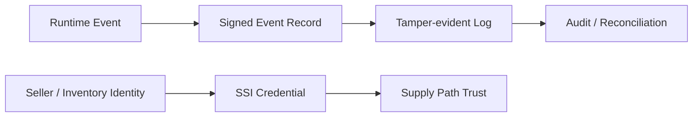

# 광고플랫폼에서 SSI와 Blockchain으로 실험할 수 있는 것

## 문서 목적

현재 광고플랫폼의 표준과 운영 구조를 전제로, SSI와 blockchain 같은 기술을 어디에 실험적으로 적용할 수 있는지 정리한다.

## 핵심 요약

- SSI와 blockchain은 현재 광고플랫폼의 필수 구성 요소가 아니다.
- 그러나 seller identity, inventory provenance, tamper-evident audit trail, cryptographic proof 같은 문제를 더 강하게 다루고 싶을 때 실험 가치가 있다.
- 이 주제는 OpenRTB, measurement, reconciliation, source of truth 구조를 이해한 뒤에 다루는 것이 적절하다.

## 어떤 문제를 더 강하게 다루고 싶은가

광고플랫폼에서 반복되는 질문은 아래와 같다.

- 이 seller identity를 더 강하게 증명할 수 있는가
- 이벤트가 실제로 어느 계층에서 발생했는지 provenance를 남길 수 있는가
- 이후 정산 또는 감사 시 log 변조 가능성을 더 낮출 수 있는가
- 다자간 시스템에서 동일한 event chain을 더 투명하게 설명할 수 있는가

## 실험 가능한 적용 지점

### 1. SSI 기반 identity 실험

- seller, publisher, inventory owner의 자격 정보를 검증 가능한 credential 형태로 다루는 접근이다.
- ads.txt, sellers.json을 대체하기보다 보강층으로 생각하는 편이 현실적이다.

### 2. blockchain 또는 tamper-evident log 실험

- 모든 광고 이벤트를 공개형 체인에 올리는 접근은 비용과 성능 측면에서 비현실적일 수 있다.
- 반면 정산 핵심 이벤트나 감사용 digest만 별도 증명 계층에 남기는 방식은 검토 가치가 있다.

### 3. provenance 중심 실험

- bid request, creative handoff, player runtime event, billing event 사이의 연결고리를 더 강하게 설명하는 문제다.
- 이 영역은 OpenRTB 3.0이 제기했던 signed request, provenance 문제의식과도 맞닿아 있다.

## 해석 원칙

- Web3를 현재 광고플랫폼의 기본 구조처럼 설명하지 않는다.
- 기존 표준과 운영 장치를 먼저 이해한 뒤, 그 한계를 보강하는 실험으로만 다룬다.
- 공개형 blockchain이 아니어도 cryptographic proof, signed log, verifiable credential 같은 구성은 충분히 실험 대상이 될 수 있다.

## 선행 문서

- [OpenRTB 3.0은 왜 널리 확장되지 못했고 2.6은 왜 이어졌는가](/standards/openrtb-3-and-2-6)
- [Discrepancy와 Reconciliation 개요](/measurement/discrepancy-and-reconciliation)
- [이벤트 로그 스키마 설계 기초](/implementation/event-log-schema)

## 관련 문서

- [Trust · Web3 실험실](/lab/)
- [sellers.json과 schain 이해](/measurement/sellers-json-and-schain)
