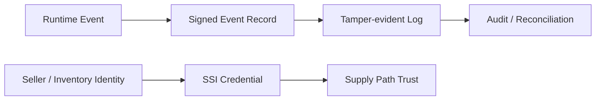
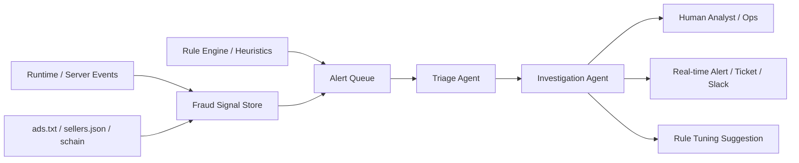

# 광고플랫폼에서 SSI, Blockchain, AI Agent로 실험할 수 있는 것

## 문서 목적

현재 광고플랫폼의 표준과 운영 구조를 전제로, SSI, blockchain, AI agent 같은 기술을 어디에 실험적으로 적용할 수 있는지 정리한다.

## 핵심 요약

- SSI, blockchain, AI agent는 현재 광고플랫폼의 필수 구성 요소가 아니다.
- 그러나 seller identity, inventory provenance, tamper-evident audit trail, cryptographic proof 같은 문제를 더 강하게 다루고 싶을 때 실험 가치가 있다.
- 최근의 agent 기술은 ad fraud, IVT, spoofing, supply path abuse 같은 문제에 대해 `실시간 triage -> 조사 -> 알림` 계층을 얹는 방식으로도 검토할 수 있다.
- 이 주제는 OpenRTB, measurement, reconciliation, source of truth 구조를 이해한 뒤에 다루는 것이 적절하다.

## 어떤 문제를 더 강하게 다루고 싶은가

광고플랫폼에서 반복되는 질문은 아래와 같다.

- 이 seller identity를 더 강하게 증명할 수 있는가
- 이벤트가 실제로 어느 계층에서 발생했는지 provenance를 남길 수 있는가
- 이후 정산 또는 감사 시 log 변조 가능성을 더 낮출 수 있는가
- 다자간 시스템에서 동일한 event chain을 더 투명하게 설명할 수 있는가

## 실험 가능한 적용 지점

### 1. SSI 기반 identity 실험

- seller, publisher, inventory owner의 자격 정보를 검증 가능한 credential 형태로 다루는 접근이다.
- ads.txt, sellers.json을 대체하기보다 보강층으로 생각하는 편이 현실적이다.

### 2. blockchain 또는 tamper-evident log 실험

- 모든 광고 이벤트를 공개형 체인에 올리는 접근은 비용과 성능 측면에서 비현실적일 수 있다.
- 반면 정산 핵심 이벤트나 감사용 digest만 별도 증명 계층에 남기는 방식은 검토 가치가 있다.

### 3. provenance 중심 실험

- bid request, creative handoff, player runtime event, billing event 사이의 연결고리를 더 강하게 설명하는 문제다.
- 이 영역은 OpenRTB 3.0이 제기했던 signed request, provenance 문제의식과도 맞닿아 있다.

### 4. AI agent 기반 ad fraud 실시간 탐지 · 조사 · 알림 실험

최근의 agent 기술은 `모델 + 도구 + 지침/가드레일` 조합으로, 여러 시스템을 넘나드는 분석과 오케스트레이션에 강점을 보인다. 이 관점은 광고 사기 대응에도 그대로 옮겨볼 수 있다.

광고플랫폼에서 반복적으로 마주치는 문제는 아래와 같다.

- 갑작스러운 impression / click burst가 정상 트래픽인지 IVT인지 빨리 판단해야 한다.
- domain / app spoofing, schain mismatch, seller identity 이상 징후를 여러 로그에서 함께 해석해야 한다.
- alert는 많지만 사람이 모두 보기는 어렵기 때문에 우선순위화와 요약이 필요하다.
- 탐지 룰은 계속 고쳐야 하고, 잘못된 탐지는 운영팀 피로를 키운다.

이때 agent는 `탐지 모델 자체`라기보다 `탐지 체계 위의 조사/판단 오케스트레이션 계층`으로 두는 편이 현실적이다.

실험 가능한 적용 지점은 아래와 같다.

- triage agent: 대량 alert를 우선순위화하고, 왜 이상 징후로 봤는지 요약한다.
- investigation agent: SSP 로그, client event, schain, ads.txt 계층을 교차 조회해 원인을 정리한다.
- notification agent: 특정 risk threshold를 넘으면 운영 채널로 실시간 알림을 보낸다.
- detection engineering agent: 자주 발생하는 패턴을 바탕으로 룰 보강안을 제안한다.

다만 이 접근은 몇 가지 원칙을 지켜야 한다.

- 결정권한을 agent에 바로 넘기지 않고, 우선은 `read-heavy assistant`로 시작한다.
- 차단이나 billing 영향이 있는 액션은 사람 승인과 deterministic rule을 함께 둔다.
- agent의 설명 가능성과 trace를 남겨야 나중에 오탐과 누락을 복기할 수 있다.

이 해석은 OpenAI가 설명하는 agent의 기본 구성과 가드레일 원칙, 그리고 Google Cloud가 보안 운영에서 제시하는 `agentic SOC` 패턴을 광고 사기 대응 도메인으로 옮겨 본 것이다. 즉, 현재 광고플랫폼 표준을 대체하는 이야기가 아니라 `운영 자동화와 대응 속도`를 높이는 확장 아키텍처로 보는 편이 맞다.

## 해석 원칙

- Web3와 AI agent를 현재 광고플랫폼의 기본 구조처럼 설명하지 않는다.
- 기존 표준과 운영 장치를 먼저 이해한 뒤, 그 한계를 보강하는 실험으로만 다룬다.
- 공개형 blockchain이 아니어도 cryptographic proof, signed log, verifiable credential 같은 구성은 충분히 실험 대상이 될 수 있다.
- AI agent는 deterministic rule, measurement vendor, fraud engine을 대체하기보다 그 위에서 조사와 대응을 가속하는 계층으로 해석한다.

## 선행 문서

- [OpenRTB 3.0은 왜 널리 확장되지 못했고 2.6은 왜 이어졌는가](/standards/openrtb-3-and-2-6)
- [Discrepancy와 Reconciliation 개요](/measurement/discrepancy-and-reconciliation)
- [이벤트 로그 스키마 설계 기초](/implementation/event-log-schema)

## 관련 문서

- [Trust · Web3 실험실](/lab/)
- [sellers.json과 schain 이해](/measurement/sellers-json-and-schain)

## 참고한 공식 문서

- [A practical guide to building AI agents](https://openai.com/business/guides-and-resources/a-practical-guide-to-building-ai-agents/)
- [Agentic SOC](https://cloud.google.com/solutions/security/agentic-soc)
- [New capabilities for building agents on the Anthropic API](https://claude.com/blog/agent-capabilities-api)
