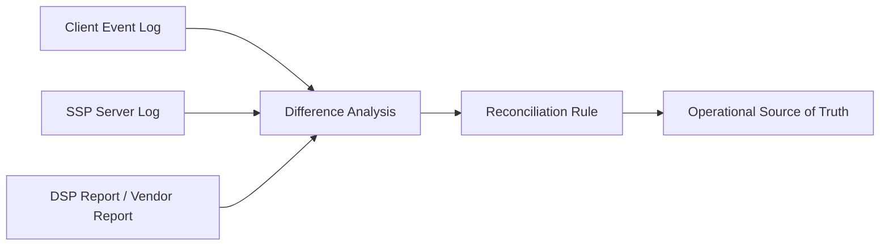

# Discrepancy와 Reconciliation 개요

## 문서 목적

광고플랫폼에서 서로 다른 시스템의 집계값이 왜 달라지는지, 그리고 그 차이를 어떻게 맞추는지의 기본 구조를 설명한다.

## 핵심 요약

- `discrepancy`는 플랫폼 간 집계 차이를 뜻한다.
- `reconciliation`은 그 차이를 원인별로 분석하고 운영 기준값을 맞추는 과정이다.
- SSP, DSP, SDK, measurement vendor는 서로 다른 시점과 기준으로 이벤트를 기록하기 때문에 차이가 자연스럽게 발생한다.

## 기본 흐름

## 본문 구조 초안

### 1. discrepancy가 생기는 이유

- 이벤트 발생 시점 차이
- 렌더링 성공 여부 판단 기준 차이
- 중복 수집과 timeout

### 2. reconciliation이 필요한 이유

- 과금과 리포팅 기준을 맞추기 위해서
- 운영팀과 개발팀이 동일한 source of truth를 갖기 위해서

### 3. 실무적으로 확인할 항목

- server log와 client log의 역할
- measurement vendor 집계 위치
- idempotency와 deduplication 처리

## 선행 개념

- [신뢰와 Web3로 확장되는 광고플랫폼 이해](/trust/)

## 다음으로 읽을 문서

- [sellers.json과 schain 이해](/measurement/sellers-json-and-schain)
