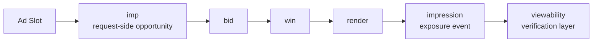

# imp와 impression은 왜 다른가

## 문서 목적

광고플랫폼에서 자주 헷갈리는 `imp`와 `impression`을 시점, 데이터 구조, 책임 주체 기준으로 구분해서 설명한다.

## 핵심 요약

- `imp`는 OpenRTB bid request 안에서 광고 기회를 정의하는 요청 객체다.
- `impression`은 광고가 실제 노출로 기록되는 시점의 이벤트다.
- 따라서 `imp`와 `impression`은 같은 단어 뿌리를 쓰지만, 같은 개념이 아니다.
- 설계에서는 `요청`, `낙찰`, `노출`, `검증` 단계를 분리해야 정산과 트래킹이 꼬이지 않는다.

## 한 장 요약

## 1. `imp`는 무엇인가

- `imp`는 OpenRTB bid request 안에 들어가는 객체다.
- SSP 또는 exchange가 DSP에게 `이런 광고 기회가 있다`고 설명할 때 사용한다.
- 즉, 광고가 실제로 보였다는 뜻이 아니라 광고를 보여줄 수 있는 기회를 정의하는 구조다.

## 2. `impression`은 무엇인가

- `impression`은 광고가 노출로 기록되는 시점의 이벤트 또는 집계 단위다.
- 이 이벤트는 일반적으로 SDK, player, tag, tracking runtime 같은 클라이언트 실행 계층에서 발생한다.
- display, video, SDK 구현, measurement vendor 기준에 따라 세부 카운팅 조건은 다를 수 있다.

## 3. 시점 차이로 보면 더 명확하다

|단계|핵심 개념|설명|
|---|---|---|
|요청|`imp`|광고 기회가 정의된다.|
|입찰|`bid`|DSP가 해당 기회에 대해 응답한다.|
|낙찰|`win`|SSP가 최종 광고를 선택한다.|
|노출 준비|`render`|SDK, player, WebView가 creative를 실행한다.|
|노출 기록|`impression`|광고가 노출 이벤트로 기록된다.|
|가시성 검증|`viewability`|노출 이후 실제 보였는지를 별도로 검증한다.|

## 4. 실무 설계에서는 무엇을 분리해야 하는가

|단계|주요 이벤트|주 책임 주체|
|---|---|---|
|요청|`imp` 생성|SSP 또는 ad server|
|낙찰|`win notice`|SSP, DSP|
|렌더링|creative render|SDK, player, WebView|
|노출|`impression`|SDK, client tracker, player|
|검증|viewability, verification|OMID, measurement vendor, SDK integration|

## 5. 왜 자주 꼬이는가

- `imp`라는 이름 때문에 실제 impression과 같은 것으로 오해하기 쉽다.
- 서버에서 win 이후 바로 impression처럼 집계하면 실제 렌더링 실패가 반영되지 않는다.
- viewability와 impression을 같은 것으로 보면 검증 레이어 설계가 흐려진다.

## 6. 현업에서 자주 터지는 리스크

### 서버 기준 impression 집계

- 실제로 사용자 화면에 보이지 않았는데 카운트될 수 있다.
- 광고주 기준 신뢰도가 떨어지고 discrepancy가 커진다.

### 렌더링 실패 미반영

- win은 되었지만 creative가 실행되지 않았을 수 있다.
- 이 경우 수익, 과금, 성과 지표가 어긋난다.

### viewability 미분리

- impression은 발생했지만 실제로 사용자가 봤는지는 별도 문제다.
- OMID, verification, viewability 기준이 따로 필요한 이유가 여기에 있다.

## 구현 관점 메모

- 서버 로그에는 `request_id`, `imp_id`, `auction_id`, `win` 시점을 남긴다.
- 클라이언트 로그에는 `render`, `impression`, `click`, `quartile`, `viewability`를 별도로 남긴다.
- 정합성 분석에서는 `imp_id`와 `auction_id`가 서버-클라이언트 연결고리 역할을 한다.
- 따라서 설계 관점 핵심은 `요청 / 낙찰 / 노출 / 검증` 4단계를 분리하는 것이다.

## 선행 개념

- [site, app, imp 객체 읽는 법](/standards/site-app-imp)

## 다음으로 읽을 문서

- [TrackingEvents, impression, click, quartile 이해](/measurement/tracking-events)
- [Discrepancy와 Reconciliation 개요](/measurement/discrepancy-and-reconciliation)

## 함께 읽을 문서

- [OpenRTB 2.6 핵심 필수 · 권장 항목 한눈에 보기](/standards/openrtb-required-and-recommended)
- [adm 필드는 무엇을 담는가](/delivery/adm-field)
- [이벤트 로그 스키마 설계 기초](/implementation/event-log-schema)
