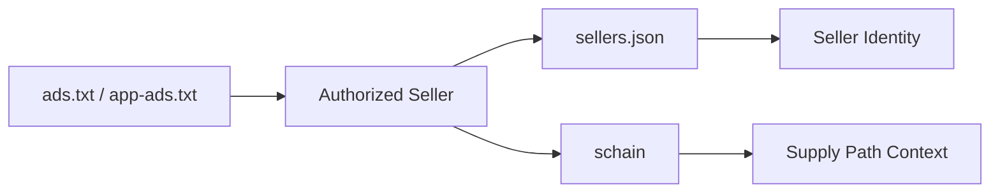

# sellers.json과 schain 이해

## 문서 목적

공급 경로 투명성을 설명할 때 함께 언급되는 `sellers.json`과 `schain`의 역할을 정리한다.

## 핵심 요약

- `sellers.json`은 seller identity를 공개하는 장치다.
- `schain`은 특정 bid request가 어떤 공급 경로를 거쳐 왔는지 설명하는 장치다.
- ads.txt와 app-ads.txt가 판매 권한 공개의 출발점이라면, sellers.json과 schain은 공급 경로 해석을 보강하는 수단이다.

## 개념 흐름

## 본문 구조 초안

### 1. sellers.json

- seller id와 seller type을 공개한다.
- 공급 측 식별을 해석하는 데 도움을 준다.

### 2. schain

- 공급 경로 정보를 bid request 안에서 전달한다.
- 중간 hop과 판매 경로를 설명하는 데 쓰인다.

### 3. ads.txt와의 관계

- ads.txt만으로는 seller identity와 경로 해석이 충분하지 않을 수 있다.
- sellers.json과 schain이 이를 보강한다.

## 선행 개념
- [신뢰와 Web3로 확장되는 광고플랫폼 이해](/trust/)
- [ads.txt와 app-ads.txt 이해](/standards/ads-txt-and-app-ads-txt)
