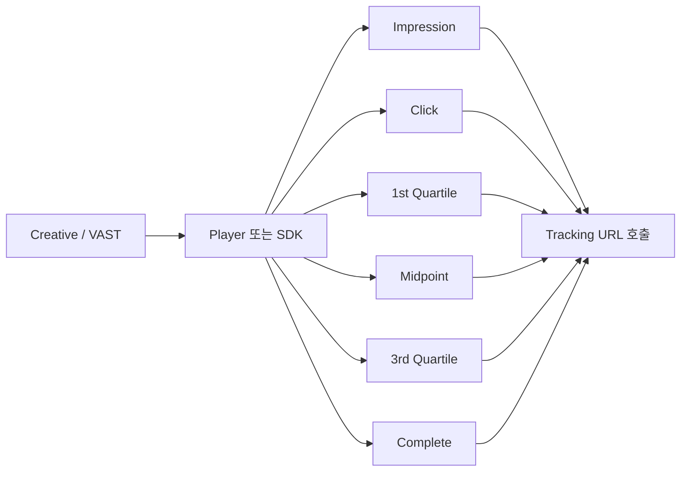

# TrackingEvents, impression, click, quartile 이해

## 문서 목적

광고플랫폼에서 자주 보는 이벤트 용어와 기본 집계 단위를 정리한다. 특히 video와 VAST 문맥에서 자주 등장하는 `TrackingEvents`, `impression`, `click`, `quartile`이 각각 어떤 역할을 하는지 설명한다.

## 핵심 요약

- `impression`은 광고가 노출되었거나 노출 가능한 상태에 들어섰다는 기준 이벤트다.
- `click`은 사용자가 광고 상호작용을 수행했다는 이벤트다.
- `quartile`은 video 광고 재생 진행률을 25%, 50%, 75%, 100% 기준으로 나눈 이벤트다.
- `TrackingEvents`는 이러한 이벤트가 발생했을 때 호출할 tracking URL 집합을 뜻한다.
- `imp`는 요청 객체이고, `impression`은 런타임 이벤트라는 점을 먼저 분리해서 이해해야 한다.

## 개념 흐름

## 1. impression은 무엇을 뜻하는가

- display에서는 creative가 렌더링되거나 viewable 상태에 들어가는 순간과 연결되는 경우가 많다.
- video에서는 player가 광고 재생을 시작할 수 있는 상태가 된 시점과 연결되는 경우가 많다.
- 다만 정확한 기준은 플랫폼, SDK, measurement vendor에 따라 조금씩 다를 수 있다.

## 1-1. 요청과 노출은 다른 단계다

|단계|주요 이벤트|주 책임 주체|
|---|---|---|
|요청|`imp` 생성|SSP 또는 ad server|
|낙찰|`win notice`|SSP, DSP|
|렌더링|creative render|SDK, player, WebView|
|노출|`impression`|SDK, client tracker, player|
|검증|viewability, verification|OMID, measurement vendor, SDK integration|

이 표의 핵심은 `imp`가 이미 요청 단계에서 존재한다는 점이다. 반면 `impression`은 render 이후 노출로 기록되는 이벤트다.

## 2. click은 무엇을 뜻하는가

- 사용자가 creative를 누르거나 상호작용했음을 기록한다.
- display와 video 모두 존재할 수 있지만, 수집 위치는 player, SDK, tag, measurement vendor에 따라 다를 수 있다.
- click 수치는 impression보다 훨씬 적고, 따라서 중복 수집이나 bot filtering의 영향이 상대적으로 크게 보일 수 있다.

## 3. quartile은 언제 쓰이는가

- quartile은 주로 video 광고에서 재생 진행률을 표준화해서 측정할 때 쓰인다.
- 일반적으로 `start`, `firstQuartile`, `midpoint`, `thirdQuartile`, `complete` 순서로 이벤트가 발생한다.
- video completion rate나 drop-off 분석은 이 이벤트를 기준으로 계산한다.

## 4. TrackingEvents는 무엇인가

- VAST 문맥에서는 각 이벤트에 대응하는 tracking URL 목록이 정의된다.
- player 또는 SDK는 이벤트가 발생할 때 해당 URL을 호출한다.
- 따라서 tracking은 creative markup, player 동작, 네트워크 호출, 서버 집계가 함께 맞물려야 정상 동작한다.

## 5. 왜 집계값이 달라지는가

- 플레이어가 이벤트를 발생시켰어도 네트워크 호출이 실패할 수 있다.
- SSP, DSP, measurement vendor는 서로 다른 시점과 조건에서 이벤트를 기록할 수 있다.
- autoplay, mute, buffering, skip, background 전환 같은 실행 맥락도 수치 차이를 만든다.

## 구현 관점 메모

- 이벤트 스키마에서는 `event_name`, `event_time`, `creative_id`, `auction_id`, `placement_id`, `device/session 식별자`를 함께 남겨야 이후 정합성 분석이 가능하다.
- impression과 quartile은 video runtime에서 자주 누락되거나 중복될 수 있으므로 idempotency 기준이 필요하다.

## 관련 문서

- [imp와 impression은 왜 다른가](/measurement/imp-vs-impression)
- [adm 필드는 무엇을 담는가](/delivery/adm-field)
- [Discrepancy와 Reconciliation 개요](/measurement/discrepancy-and-reconciliation)
- [이벤트 로그 스키마 설계 기초](/implementation/event-log-schema)
