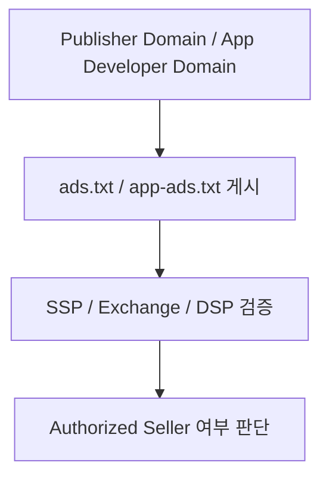

# ads.txt와 app-ads.txt 이해

## 문서 목적

퍼블리셔 인증과 공급 경로 투명성의 출발점이 되는 `ads.txt`와 `app-ads.txt`의 역할을 설명한다.

## 핵심 요약

- `ads.txt`는 웹 퍼블리셔가 자신의 도메인에서 공개하는 authorized sellers 목록이다.
- `app-ads.txt`는 앱 환경에서 같은 목적을 수행하는 표준이다.
- 이 표준은 판매 권한 공개와 사칭 방지에 도움을 주지만, 실제 온보딩과 지면 등록 자체를 대체하지는 않는다.

## 개념 흐름

## 본문 구조 초안

### 1. ads.txt란 무엇인가

- 웹 퍼블리셔 도메인에 게시되는 seller 권한 공개 파일이다.
- 어떤 판매자가 해당 인벤토리를 판매할 수 있는지 선언한다.

### 2. app-ads.txt란 무엇인가

- 앱과 CTV 앱 환경에서 seller 권한을 공개하기 위한 표준이다.
- 앱스토어 정보와 개발자 도메인을 통해 검증 경로를 만든다.

### 3. 왜 중요한가

- inventory spoofing과 seller 사칭을 줄이는 데 도움을 준다.
- 공급 경로 투명성의 기본 레이어 역할을 한다.

### 4. 한계

- 이것만으로 모든 사기나 품질 문제를 해결하지는 못한다.
- 실제 운영에서는 sellers.json, schain, 로그 검증 같은 추가 장치가 함께 필요하다.

## 선행 문서

- [퍼블리셔 온보딩과 지면 등록](/fundamentals/publisher-onboarding)

## 다음으로 읽을 문서

- [sellers.json과 schain 이해](/measurement/sellers-json-and-schain)
