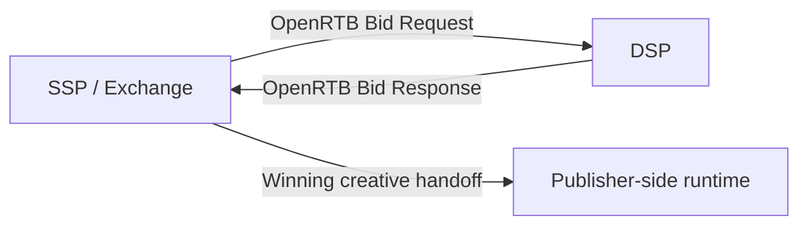

# DSP ↔ SSP / Exchange: RTB 경매 구간

## 문서 목적

광고플랫폼에서 가장 강하게 표준화된 구간인 `DSP ↔ SSP / Exchange` 경매 흐름을 설명한다. 이 문서는 OpenRTB가 실제로 어떤 책임을 담당하는지 이해하는 기준선 역할을 한다.

## 핵심 요약

- 이 구간은 광고플랫폼에서 OpenRTB가 가장 직접적으로 적용되는 대표 구간이다.
- SSP 또는 Exchange는 bid request를 만들고, DSP는 bid response를 반환한다.
- `imp`, `site/app`, `device`, `user`, `source`, `regs`, `pmp`는 이 구간에서 핵심이다.
- `price`, `adm`, `nurl`, `burl`, `dealid`, `crid`는 response 측 이해에 중요하다.

## 이 구간의 주요 관심사

|관심사|설명|
|---|---|
|입찰 판단|DSP가 이 요청에 입찰할지, 얼마를 낼지 판단|
|경매 제어|auction type, timeout, blocked category, seat 제한|
|크리에이티브 전달|낙찰 시 어떤 creative markup 또는 VAST를 넘길지 결정|
|딜 처리|PMP / Deal 조건을 어떻게 적용할지 판단|
|규제와 프라이버시|regs, consent, ID signal, supply transparency를 해석|

## 표준 프로토콜 존재 여부

|항목|판단|
|---|---|
|대표 표준 프로토콜|OpenRTB|
|적용 범위|주로 SSP / Exchange ↔ DSP의 경매 요청과 응답|
|실무 확장 포인트|supply chain, identity, privacy, CTV 관련 필드가 계속 보강됨|

## bid request에서 자주 보는 핵심 필드

- `id`
- `imp`
- `site` 또는 `app`
- `device`
- `user`
- `source`
- `regs`
- `pmp`
- `at`, `tmax`, `cur`, `bcat`, `badv`, `wseat`, `bseat`

## bid response에서 자주 보는 핵심 필드

- `price`
- `adm`
- `nurl`
- `burl`
- `lurl`
- `adomain`
- `crid`
- `dealid`

## 이 구간의 데이터 흐름

## 실무 해석

이 구간은 `누가 어떤 가격과 creative로 입찰할 것인가`를 정하는 구간이다. 따라서 request의 품질과 response의 해석 가능성이 모두 중요하다. SDK가 실제로 광고를 렌더링하더라도, 경매 판단의 핵심 데이터는 여기에서 오간다.

## 관련 문서

- [OpenRTB는 무엇인가](/standards/openrtb-overview)
- [OpenRTB 2.6 핵심 필수 · 권장 항목 한눈에 보기](/standards/openrtb-required-and-recommended)
- [OpenRTB 상위 제어 필드 읽는 법](/standards/top-level-control-fields)
- [SSP ↔ Publisher SDK / Player / Tag: 광고 전달 구간](/standards/ssp-to-publisher-sdk)
