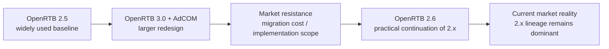

# OpenRTB 3.0은 왜 널리 확장되지 못했고 2.6은 왜 이어졌는가

## 문서 목적

OpenRTB 2.5 이후 표준이 어떤 방향으로 진화했는지, 그리고 왜 실무에서는 OpenRTB 3.0보다 2.6 계열이 더 현실적인 연장선으로 받아들여졌는지 설명한다.

## 핵심 요약

- OpenRTB 3.0은 단순한 minor upgrade가 아니라 AdCOM, Ad Management와 함께 더 큰 구조 개편을 제안했다.
- 이 방향은 개념적으로 정교했지만, 실제 시장에서는 마이그레이션 비용과 연동 복잡도가 높았다.
- IAB Tech Lab은 이후 OpenRTB 3.0과 AdCOM의 아이디어가 2.x에 부분적으로 흡수되는 현실을 반영해 OpenRTB 2.6을 발표했고, 더 빠른 시장 적용을 강조했다.
- 따라서 현재 광고플랫폼 학습에서는 `2.5 -> 3.0의 문제의식 -> 2.6의 현실적 진화` 순서로 이해하는 편이 가장 자연스럽다.

## 버전 흐름 한눈에 보기

## 1. OpenRTB 3.0이 제시한 문제의식

OpenRTB 3.0은 기존 2.x의 bid request / bid response 구조를 단순히 확장하는 대신, 광고 객체 공통 모델과 관리 계층을 분리해서 더 일관된 구조를 만들려 했다. 이 방향은 장기적으로는 의미가 있다.

대표적인 특징은 아래와 같다.

- AdCOM과 함께 광고 객체 모델을 재정의하려 했다.
- 단순 경매 메시지보다 더 넓은 상호운용성을 지향했다.
- signed bid request, provenance, 보안성 강화 같은 방향을 더 강하게 포함했다.

## 2. 왜 널리 확장되지 못했는가

IAB Tech Lab은 이후 OpenRTB 3.0과 AdCOM 기능이 다시 2.x 생태계 안으로 흡수되는 현실을 설명했다. 이를 보면 아래 해석이 가능하다.

- 3.0은 단독 버전 업그레이드가 아니라 여러 사양을 함께 이해해야 하는 구조였다.
- 기존 2.x 연동이 이미 넓게 퍼져 있어 전면 마이그레이션 유인이 크지 않았다.
- 공급 측과 수요 측 모두 기존 연동을 유지하면서 필요한 기능만 빠르게 추가하는 편을 선호했다.

위 해석은 IAB Tech Lab이 `3.0 / AdCOM 기능이 오래된 2.x에 hack되고 있었다`고 설명한 흐름과, 2.6 공개 시 `faster speed to market`을 강조한 메시지를 종합한 것이다.

## 3. 왜 2.6이 이어졌는가

OpenRTB 2.6은 2.x 계열을 유지하면서도 시장에서 필요한 기능을 더 직관적으로 반영하려는 접근에 가깝다.

실무적으로는 아래 이유 때문에 이해 가치가 크다.

- 기존 2.5 기반 연동과의 연속성이 높다.
- 현재 운영 중인 SSP, DSP, exchange 연동 현실과 더 가깝다.
- 구현자 입장에서 incremental migration이 가능하다.

즉, 2.6은 3.0의 문제의식을 완전히 버린 결과라기보다, 시장이 실제로 받아들일 수 있는 속도로 되돌려 적용한 현실적 진화로 읽는 편이 맞다.

## 4. 이 핸드북에서의 해석 원칙

- OpenRTB 2.5는 현재 실무의 기준선이다.
- OpenRTB 3.0은 미래 지향적 설계 문제의식을 보여준다.
- OpenRTB 2.6은 현재 시장에서 더 중요한 현실적 연결고리다.
- SSI, provenance, cryptographic proof 같은 논의는 그 다음 단계의 실험실 주제로 읽는 것이 적절하다.

## 관련 문서

- [OpenRTB는 무엇인가](/standards/openrtb-overview)
- [site, app, imp 객체 읽는 법](/standards/site-app-imp)
- [Trust · Web3 실험실](/lab/)

## 참고한 공식 문서

- [Welcome Back, OpenRTB 2.x](https://iabtechlab.com/welcome-back-openrtb-2-x/)
- [Tech Lab Releases OpenRTB 2.6 for Public Comment](https://dev.iabtechlab.com/press-releases/tech-lab-releases-openrtb-2-6-for-public-comment/)
- [IAB Tech Lab OpenRTB Standard](https://dev.iabtechlab.com/standards/openrtb/)
