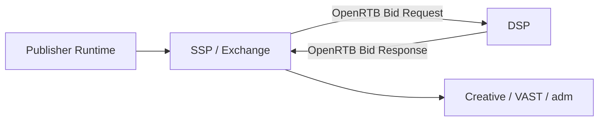

# OpenRTB는 무엇인가

## 문서 목적

광고플랫폼에서 가장 널리 쓰이는 실시간 입찰 표준인 `OpenRTB`의 역할과 범위를 설명한다.

## 핵심 요약

- OpenRTB는 SSP 또는 Exchange와 DSP 사이의 입찰 통신을 위한 표준 객체 체계다.
- 모든 광고플랫폼 동작을 정의하는 표준은 아니며, 특히 렌더링과 측정은 다른 표준과 함께 읽어야 한다.
- OpenRTB를 이해하면 `imp`, `site`, `app`, `device`, `user`, `regs` 같은 핵심 객체를 읽을 수 있게 된다.

## 왜 중요한가

- 입찰 요청과 응답 구조를 공통 언어로 맞춘다.
- 공급 측과 수요 측의 통신 비용을 줄인다.
- 객체 단위로 어떤 정보가 경매 판단에 쓰이는지 이해할 수 있게 한다.

## 한 장 요약

## 본문 구조 초안

### 1. OpenRTB가 다루는 범위

- bid request
- bid response
- auction context

### 2. 함께 읽으면 좋은 주변 주제

- ads.txt와 app-ads.txt
- creative 렌더링과 `adm`
- verification과 measurement

### 3. 처음 읽을 때 봐야 할 객체

- `imp`
- `site` 또는 `app`
- `device`
- `user`
- `regs`

## 후속 연결 문서

- [site, app, imp 객체 읽는 법](/standards/site-app-imp)
- [ads.txt와 app-ads.txt 이해](/standards/ads-txt-and-app-ads-txt)
- [adm 필드는 무엇을 담는가](/delivery/adm-field)
