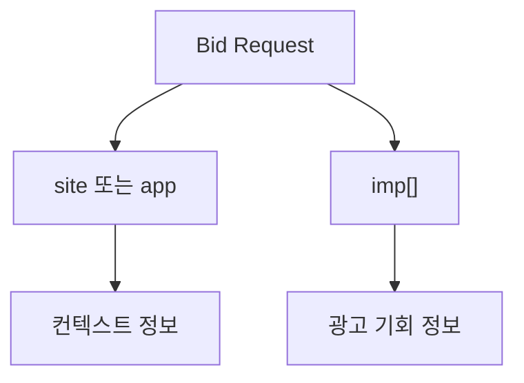

# site, app, imp 객체 읽는 법

## 문서 목적

OpenRTB를 처음 읽는 사람이 가장 먼저 접하는 핵심 객체인 `site`, `app`, `imp`를 구분해서 이해할 수 있도록 정리한다.

## 핵심 요약

- `imp`는 실제 광고 기회 자체를 표현한다.
- `site`는 웹 맥락, `app`은 앱 또는 CTV 앱 맥락을 표현한다.
- 일반적으로 하나의 bid request에는 `site`와 `app`이 동시에 들어가지 않는다.

## 데이터 흐름 관점

## 본문 구조 초안

### 1. `imp`

- 광고 슬롯 또는 광고 기회를 표현한다.
- banner, video, native 같은 포맷 정보와 연결된다.

### 2. `site`

- 웹사이트 또는 모바일 웹 문맥을 표현한다.
- domain, page, publisher 정보와 연결된다.

### 3. `app`

- 앱 또는 CTV 앱 문맥을 표현한다.
- bundle, storeurl, app publisher 정보와 연결된다.

## 후속 연결 문서

- [OpenRTB는 무엇인가](/standards/openrtb-overview)
- [ads.txt와 app-ads.txt 이해](/standards/ads-txt-and-app-ads-txt)
