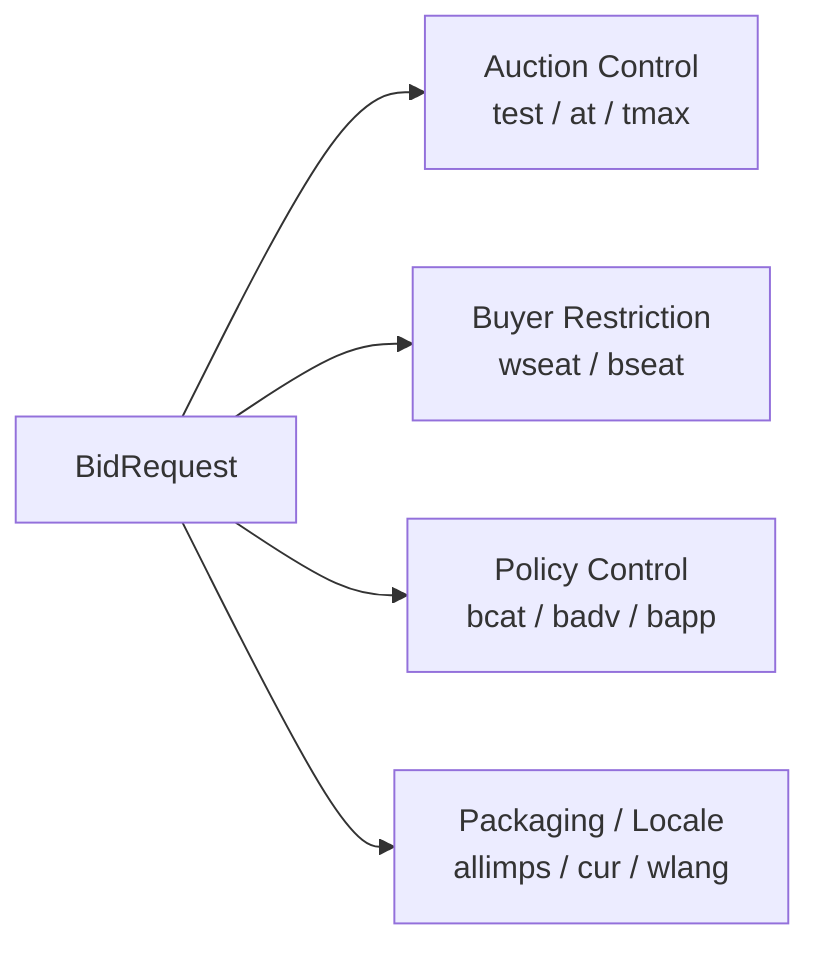

# OpenRTB 상위 제어 필드 읽는 법

## 문서 목적

OpenRTB `BidRequest`의 상단에서 경매 방식, 응답 시간, buyer 제약, 차단 정책을 제어하는 핵심 필드를 정리한다. 이 문서는 `site`, `app`, `device`, `user` 같은 컨텍스트 객체가 아니라, `거래를 어떤 규칙으로 진행할 것인가`를 설명하는 상위 제어 신호에 집중한다.

## 핵심 요약

- `test`, `at`, `tmax`는 경매의 실행 방식과 시간 제약을 정의한다.
- `wseat`, `bseat`, `bcat`, `badv`, `bapp`는 누가 입찰할 수 있고 어떤 광고를 막을지 정하는 제한 조건이다.
- `cur`, `wlang`, `allimps`는 통화, 언어, 패키징 범위를 설명하는 보조 제어 필드다.
- 이 필드들은 화려하지 않지만, 실제 exchange 운영과 bidder 해석에서 매우 중요하다.

## 한 장 요약

## 1. 왜 이 필드들이 중요한가

- `imp`, `site`, `app`은 무엇을 팔지 설명한다.
- 반면 상위 제어 필드는 그 광고 기회를 어떤 조건으로 거래할지를 정의한다.
- 따라서 이 필드들이 비어 있거나 해석이 불분명하면, buyer는 입찰을 보수적으로 하거나 응답 자체를 포기할 수 있다.

## 2. 경매 제어 필드

|필드|표준 기준|실무 중요도|실무 해석|
|---|---|---|---|
|`test`|선택, 기본값 `0`|중간|실거래인지 테스트 요청인지를 구분한다. 테스트 트래픽 분리가 필요하다.|
|`at`|선택, 기본값 `2`|매우 높음|경매 유형을 정의한다. buyer의 가격 전략과 정산 해석에 직접 영향을 준다.|
|`tmax`|선택|매우 높음|bidder가 응답할 수 있는 최대 시간이다. timeout과 fill rate에 직접 연결된다.|

### 구현 관점 메모

- `test`는 단순 디버그 플래그가 아니라, 과금과 성과 데이터에서 운영 트래픽을 분리하는 기준이 된다.
- `at`는 first-price인지 second-price 계열인지 해석하는 핵심 필드다. 잘못 이해하면 bid shading과 clearing price 전략이 어긋난다.
- `tmax`는 지나치게 짧으면 응답률을 떨어뜨리고, 지나치게 길면 사용자 경험과 render 타이밍을 해칠 수 있다.

## 3. buyer seat 제한 필드

|필드|표준 기준|실무 중요도|실무 해석|
|---|---|---|---|
|`wseat`|선택|높음|허용된 buyer seat만 입찰하도록 제한한다.|
|`bseat`|선택|높음|특정 buyer seat를 차단한다.|

### 구현 관점 메모

- `wseat`와 `bseat`는 일반적으로 동시에 쓰지 않는다.
- 이 필드는 buyer identity가 사전 합의되어 있을 때만 의미가 있다.
- PMP, agency seat, reseller seat 통제와 연결될 수 있다.

## 4. 차단 정책 필드

|필드|표준 기준|실무 중요도|실무 해석|
|---|---|---|---|
|`bcat`|선택|높음|차단할 광고주 카테고리를 정의한다.|
|`badv`|선택|높음|차단할 광고주 도메인을 정의한다.|
|`bapp`|선택|중간~높음|차단할 앱 식별자를 정의한다. 앱, CTV 문맥에서 특히 중요하다.|

### 구현 관점 메모

- `bcat`는 카테고리 taxonomy와 함께 읽어야 한다. 2.6에서는 `cattax`가 함께 중요해진다.
- `badv`는 advertiser domain 기준 정책과 brand safety 요구를 연결한다.
- `bapp`는 앱스토어 식별 방식과 bundle/package 관례를 정확히 맞춰야 한다.

## 5. 보조 제어 필드

|필드|표준 기준|실무 중요도|실무 해석|
|---|---|---|---|
|`allimps`|선택, 기본값 `0`|중간|해당 request의 `imp[]`가 컨텍스트 내 전체 기회를 대표하는지 표시한다. road-blocking 해석에 중요하다.|
|`cur`|선택|중간~높음|허용 통화를 지정한다. 다중 통화 거래를 받는 exchange에서는 중요하다.|
|`wlang`|선택|중간|creative 허용 언어를 지정한다. 언어 제한이 있을 때 buyer 해석에 중요하다.|

### 구현 관점 메모

- `allimps`는 모든 구현에서 자주 보이지 않지만, 멀티 슬롯 또는 pod 맥락에서는 의미가 커질 수 있다.
- `cur`는 exchange가 복수 통화를 받을 때만 강하게 중요해진다.
- OpenRTB 2.6에서는 `wlang`와 함께 `wlangb` 같은 더 현대적인 언어 표현도 고려해야 한다.

## 6. 이 문서를 어떻게 읽어야 하는가

- 이 필드들은 `필수`보다 `운영 제어` 성격이 강하다.
- 그래서 빈도는 낮아 보여도, 실제 운영에서는 해석 오류의 영향이 크다.
- 특히 `at`, `tmax`, `bcat`, `badv`는 buyer 응답 전략과 정책 적합성에 직접 영향을 준다.

## 구현 관점 메모

- 상위 제어 필드는 `auction policy`, `buyer policy`, `content policy`라는 세 묶음으로 로그와 설정에 대응시키는 편이 좋다.
- `test`, `at`, `tmax`는 request-level logging에서 반드시 별도로 보이게 하는 것이 좋다.
- `bcat`, `badv`, `bapp`는 supply-side 설정값과 request 생성 로직이 어떻게 연결되는지 함께 추적해야 한다.

## 선행 개념

- [OpenRTB는 무엇인가](/standards/openrtb-overview)

## 다음으로 읽을 문서

- [site, app, imp 객체 읽는 법](/standards/site-app-imp)
- [OpenRTB 2.6 핵심 필수 · 권장 항목 한눈에 보기](/standards/openrtb-required-and-recommended)

## 함께 읽을 문서

- [OpenRTB 3.0이 지향한 것과 2.6에 다시 반영된 것](/standards/openrtb-3-and-2-6)
- 추후 보강 예정: `regs, pmp, deal은 왜 필수도 이상으로 중요한가`

## 참고한 공식 문서

- [OpenRTB 2.6 PDF](https://iabtechlab.com/wp-content/uploads/2022/04/OpenRTB-2-6_FINAL.pdf)
- [OpenRTB 2.5 FINAL PDF](https://dev.iabtechlab.com/wp-content/uploads/2016/07/OpenRTB-API-Specification-Version-2-5-FINAL.pdf)
- [IAB Tech Lab OpenRTB Standard](https://dev.iabtechlab.com/standards/openrtb/)
