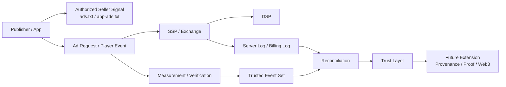

# 신뢰와 Web3로 확장되는 광고플랫폼 이해

## 문서 목적

본 문서는 광고플랫폼을 단순한 입찰 시스템이 아니라 `신뢰 계층`까지 포함한 구조로 이해하기 위한 출발점을 정리한다. 여기서 말하는 신뢰는 측정 가능성, 검증 가능성, 공급 경로 투명성, 정산 정합성, 그리고 향후 암호학적 증명 기반 확장 가능성까지 포함한다.

## 핵심 요약

- 현대 광고플랫폼은 광고 송출뿐 아니라 `누가 팔았는가`, `무엇이 실제로 노출되었는가`, `어떤 이벤트를 믿을 수 있는가`를 함께 다뤄야 한다.
- 이 문제를 풀기 위해 업계는 `ads.txt`, `app-ads.txt`, `sellers.json`, `schain`, `OMID`, verification tag, reconciliation 같은 장치를 발전시켜 왔다.
- `Web3`는 현재 광고플랫폼의 필수 요소는 아니지만, provenance, tamper-evident log, cryptographic proof 같은 확장 방향을 검토하는 데 유용한 관점을 제공한다.
- 따라서 `신뢰 + Web3` 카테고리는 기존 광고 표준의 연장선에서 읽어야 하며, 표준을 대체하는 별도 생태계로 이해하면 안 된다.

## 왜 이 카테고리가 필요한가

광고플랫폼은 퍼블리셔, SSP, DSP, 측정 벤더, 검증 벤더, 정산 시스템이 함께 참여하는 다자간 시스템이다. 이 구조에서는 단순히 광고를 전달하는 것만으로는 충분하지 않다.

실무에서 반복적으로 확인해야 하는 질문은 아래와 같다.

- 이 인벤토리를 실제로 판매할 권한이 있는가
- 광고가 의도한 지면에서 실제로 렌더링되었는가
- impression, click, quartile, completion 같은 이벤트를 어느 정도 신뢰할 수 있는가
- 플랫폼 간 집계 차이를 어떤 방식으로 조정할 것인가
- 향후 더 강한 정합성과 추적 가능성을 어떤 방식으로 확보할 것인가

## 기존 표준과의 연결

이 카테고리는 아래 문서의 연장선에서 읽는 것이 가장 자연스럽다.

- [광고 요청과 Bid Request의 차이](/fundamentals/ad-request-vs-bid-request)
- [ads.txt와 app-ads.txt 이해](/standards/ads-txt-and-app-ads-txt)

핵심 흐름은 아래와 같다.

## 이 카테고리에서 다루는 범위

### 1. 신뢰를 구성하는 현재 표준과 운영 장치

- ads.txt, app-ads.txt
- sellers.json, schain
- OMID, AdVerification
- 서버 로그와 클라이언트 로그의 교차 검증
- discrepancy와 reconciliation

### 2. 광고플랫폼의 신뢰 계층

- 공급 경로를 어떻게 설명할 것인가
- 이벤트를 어느 시스템의 source of truth로 볼 것인가
- 과금과 리포팅의 기준을 어떻게 맞출 것인가

### 3. Web3 관점의 확장 질문

- 이벤트 provenance를 더 강하게 증명할 수 있는가
- log immutability가 정산과 감사에 어떤 가치를 줄 수 있는가
- 공개형 ledger가 아니라도 cryptographic proof 계층을 적용할 수 있는가

## 해석 원칙

- `Web3`는 현재 광고플랫폼 운영의 기본 전제라기보다 확장 관점이다.
- 실무 우선순위는 항상 기존 업계 표준과 측정 체계의 정확한 이해에 있다.
- 따라서 이 카테고리는 `표준 -> 검증 -> 정합성 -> 확장 인프라` 순서로 읽는 것이 적절하다.

## 후속 문서 후보

- sellers.json과 schain 이해
- OMID와 verification의 역할 구분
- discrepancy와 reconciliation의 기본 구조
- 광고 이벤트 provenance 관점에서 본 trust layer
- 광고플랫폼에서 Web3를 논할 때 유효한 범위와 과장된 범위
